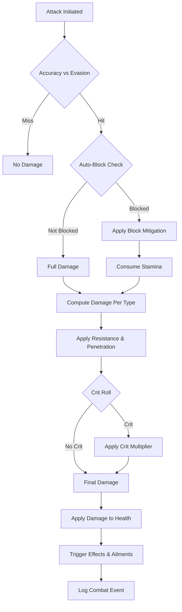

# Feature Spec: Combat System

## Metadata
- Feature ID (slug): combat-system
- Status: Draft
- Owner: JBurl
- Date: 2026-01-20

## Summary
A stat-driven, server-authoritative combat layer that implements ARPG mechanics (accuracy, evasion, block, crit, resistances, penetration) on top of Hytale's damage event system. The system integrates with Hyforged's Stats System as the source of truth for all combat calculations, supports multi-element damage resolution, monster scaling by world distance, and provides player-accessible combat logs.

## Goals
- Provide a unified combat pipeline that consumes effective stats from Hyforged's Stats System.
- Implement accuracy vs evasion checks before damage is applied.
- Support auto-block mechanics with stamina consumption and partial mitigation.
- Apply critical hit multipliers to total attack damage.
- Resolve multi-element damage with per-type resistance and penetration calculations.
- Scale monster stats (damage, health, resistances) based on distance from world spawn.
- Integrate with Hytale's native `EntityEffect` system for status effects and ailments.
- Provide per-attack combat log breakdowns accessible to players.

## Non-Goals
- Replace Hytale's core combat animations or client-side hit detection visuals.
- Perfect client-side damage prediction (server authority prioritized over latency hiding).
- Custom AI targeting or aggro systems (out of scope for this spec).
- Full status effect rework—leverage Hytale's existing `EntityEffect` where possible.

## User Experience
- Players experience consistent, stat-driven combat outcomes.
- Auto-block triggers when the player has `BlockChance` stat and sufficient stamina, reducing damage by a percentage at low stamina cost.
- Manual blocking remains available and provides full mitigation at higher stamina cost.
- Critical hits are visually indicated via combat text.
- Combat log UI shows per-attack breakdown (damage sources, mitigation, crits, blocks, misses).
- Monster difficulty scales smoothly as players explore further from spawn.

## Functional Requirements

### Combat Pipeline

### Hit Resolution
- **Accuracy vs Evasion**: Before damage is calculated, roll attacker's accuracy against defender's evasion. If the attack misses, no damage is dealt.
- **Evasion Scaling**: Evasion effectiveness is reduced against higher-level monsters (penalty applied when monster level > player level).

### Block Mechanics
- **Manual Block**: Hytale's native blocking; consumes full stamina cost, provides 100% mitigation.
- **Auto-Block**: If defender has `BlockChance` stat > 0 and stamina > 0:
  - Roll block chance.
  - If successful, apply `BlockMitigation` percentage (default 50%).
  - Consume stamina at reduced rate (e.g., 10% of manual block cost).
- Block is mutually exclusive with manual dodge input.

### Damage Calculation
- Multi-element attacks split damage by type (e.g., 50 physical + 30 fire).
- Each damage type applies independently:
  - `EffectiveResistance = max(0, Resistance - Penetration)`
  - `Mitigated = DamageOfType × (1 - EffectiveResistance / 10000)`
- Armor provides physical resistance; elemental resistances apply to elemental damage types.
- Resistances are flat percent stats (basis points, 10000 = 100%).

### Critical Hits
- Crit is rolled once per attack, not per damage type.
- Crit chance is a flat percent stat, adjusted by level difference (reduced vs higher-level monsters).
- Crit multiplier applies to total post-mitigation damage.
- Soft cap and hard cap system:
  - Soft cap (e.g., 50%) can be exceeded only with `MaxCritChance` stat bonuses.
  - Hard cap (e.g., 95%) is the absolute maximum.

### Stat Caps
- Resistance caps per element (default soft cap 75%, hard cap 90%).
- Crit chance, block chance, evasion chance all use soft/hard cap model.
- Caps are data-driven via stat definitions.

### Monster Scaling
- Monster level = f(distance from world spawn in blocks).
- Scaling curve is configurable per world.
- Scaled stats: base damage, max health, resistances.
- Monster modifiers (quality, affixes) add further stat bonuses.
- Higher-level monsters reduce effectiveness of player chance-based stats (crit, evasion, block).

### Status Effects & Ailments
- Leverage Hytale's `EntityEffect` system with extensions.
- Define ailment thresholds (e.g., freeze triggers when cold damage exceeds threshold within window).
- Duration scaling via `EffectDuration` stat.
- DoT damage (poison, bleed, burn) handled by existing `DamageCalculator` in `EntityEffect`.
- Add Hyforged tag support to effects for modifier targeting.

### Healing
- Healing is part of the combat pipeline output.
- Resistances do not affect healing.
- Healing can be modified by stats (e.g., `LifeRecoveryRate`, `HealingReceived`).

### Combat Logging
- In-memory log of last 5 combat encounters per player.
- Each encounter contains per-attack breakdowns:
  - Attacker, defender, damage sources, mitigation applied, crit, block, miss.
- Player-accessible UI (similar to PoE/WoW combat log).
- No persistent logging to disk; no admin-only logging.

## Non-Functional Requirements
- **Performance**: Combat resolution is O(1) per damage type; no entity scans per hit.
- **Determinism**: Same inputs produce same outputs (seeded RNG or documented sources).
- **Server Authority**: All combat outcomes computed server-side; client displays results.
- **Extensibility**: New damage types, ailments, and mechanics can be added via JSON and stats.

## Dependencies
- Hyforged Stats System (source of truth for all combat stats).
- Hytale `DamageEventSystem` and `Damage` class for event interception.
- Hytale `EntityEffect` system for status effects.
- Hyforged Damage Type Extensions (ADR-0007) for resistance mapping.
- Monster scaling configuration system (new).
- Combat log UI component (new).

## Data/Schema Impact
- New JSON assets for world scaling configuration.
- Extension of stat definitions for soft/hard cap metadata.
- Possible extension of `EntityEffect` JSON for Hyforged tags.
- Combat log data structure (in-memory, per player).

## API Changes
- `CombatService` API for programmatic damage application with full stat resolution.
- `CombatLogService` API for querying recent combat events.
- Extension of `StatDefinition` schema for cap configuration.

## Security/Privacy
- Server-authoritative; client cannot spoof combat outcomes.
- Combat logs contain only combat data, no PII beyond player identifiers.

## Observability
- Combat events can optionally emit metrics (damage dealt/received per entity type).
- Debug mode can enable verbose logging for balance testing.

## Risks
- **Complexity**: Multi-stage pipeline with many interacting stats may be difficult to balance.
- **Performance**: Per-hit stat lookups must remain efficient with many modifiers.
- **Hytale Integration**: Undocumented Hytale events may require workarounds.
- **Status Effect Compatibility**: Extending `EntityEffect` may conflict with future Hytale updates.

## Open Questions
1. **Exact scaling formula**: What is the function mapping distance (blocks) to monster level?
2. **Level difference penalty formula**: How much does each level of difference reduce crit/evasion/block chance?
3. **Ailment threshold values**: What are the baseline thresholds for freeze, shock, ignite?
4. **Effect tag support**: Can `EntityEffect` be extended with custom tag fields, or must we use a parallel data structure?
5. **World spawn coordinates**: Is world spawn always (0,0) or configurable per world?

## Acceptance Criteria
- [ ] Accuracy vs evasion check implemented and tested.
- [ ] Auto-block triggers correctly with stamina consumption.
- [ ] Multi-element damage applies independent resistance calculations.
- [ ] Crit roll applies multiplier to total damage.
- [ ] Soft/hard cap system enforced for crit, block, evasion, resistances.
- [ ] Monster scaling by distance from spawn implemented.
- [ ] Combat log captures per-attack breakdowns.
- [ ] Player UI displays combat log.
- [ ] Ailment thresholds trigger status effects.
- [ ] Integration tests verify deterministic outcomes.

## Impacted Areas (High-Level)
- `reign.software.hyforged.stats` — stat cap extensions.
- `reign.software.hyforged.stats.bridge` — damage reduction and new combat systems.
- `reign.software.hyforged.combat` — new combat pipeline and services (proposed).
- `Server/Hyforged/Combat/` — new configuration assets for scaling curves.
- UI components — combat log display.

## Required Codebase/Architecture Changes (High-Level)
- Create `HyforgedCombatPipelineSystem` extending `DamageEventSystem` with full combat resolution.
- Implement accuracy/evasion system (new `HyforgedHitResolutionSystem`).
- Implement auto-block system (new `HyforgedAutoBlockSystem`).
- Add soft/hard cap metadata to `StatDefinition` and evaluation logic.
- Create monster scaling service and world configuration assets.
- Create `CombatLogComponent` for per-player combat history.
- Investigate Hytale `EntityEffect` extension points for tag support.
- Unregister conflicting Hytale systems (extend ADR-0006 if needed).

## References
- Requirements: [.memory_bank/Requirements/rpg-arpg/combat-system.md](.memory_bank/Requirements/rpg-arpg/combat-system.md)
- Related ADRs:
  - ADR-0001: Hybrid Hyforged + Hytale Stats
  - ADR-0006: Replace Hytale Stat/Damage Systems
  - ADR-0007: Data-Driven Damage Type Extensions
- Stats System Spec: [.memory_bank/Features/hyforged-stats-system/hyforged-stats-system.spec.md](.memory_bank/Features/hyforged-stats-system/hyforged-stats-system.spec.md)
- Hytale Reference: `DamageEventSystem`, `Damage`, `EntityEffect`, `InteractionType`

1. Combat Pipeline Scope
What Hytale events/hooks do you intend to intercept? The current HyforgedDamageReductionSystem uses DamageEventSystem. Should the combat system:
Intercept pre-damage for crit/dodge/block resolution? yes and ideally we should remove these if we can.
Hook into attack initiation for accuracy/evasion checks? yes
Are there Hytale events for "on hit" that we can use, or do we need custom detection? Research this. Ideally we can use existing events.
2. Hit Resolution Flow
Where does hit/miss resolution occur? Is the server already authoritative for "did the attack connect" or does Hyforged need to:
Implement accuracy vs evasion checks before damage? Yes. There is no system in hytale
Determine if an attack is blocked before damage is calculated? yes, block should still consume stamina (in hytale blocking consumes stamina. But its manual. This stat would allow you to "Auto block" at a fraction of the stamina cost.)
Roll crit chance as part of damage event, or earlier? Crit should be last.
3. Damage Type Interactions
How should multi-element attacks work? For example:
An attack deals 50 physical + 30 fire damage—are resistances applied independently? Yes.
Does penetration apply per damage type (fire penetration only to fire portion)? Yes
Can a single hit crit partially (physical crits but fire doesn't)? No crit is rolled for the whole attack not for each damage source in the attack. If the attack triggers other attacks then those are rolled separately.
4. Block Mechanics
What is the block model? its manual unless you have the block chance stat.
Chance-based (block or don't)? Yes
Partial mitigation (block reduces damage by X%)? Yes, for auto block only, manual block is full mitigation.
Flat reduction (block absorbs N damage)? no %. we can add a stat for damage blocked %. 
Stamina cost on block? Yes, blocking consumes stamina. Auto blocking consumes MUCH LESS stamina.
Can block and dodge both roll, or does one supersede? There is no dodge rolling.
5. Monster Scaling Details
What is the spawn point reference? World spawn (0,0), regional spawn points, or player's initial spawn? World spawn. (i dont know if its explicitly defined as 0,0)
Distance units? Blocks? Chunks? Regions? Blocks.
What stats scale on monsters? Just damage/health, or also resistances, crit chance, etc.? Damage, health, resistances. I would like monsters to have modifiers and quality. They can have affixes that modify these stats as well. And buffs for their modifier.
How are scaling parameters configured? Per-world? Per-dimension? Global config? per world.
6. Status Effects and DoT
Are status effects (bleed, poison, ignite) in scope for this spec? The requirements mention "applied effects" as outputs. Should this spec define: We need to define `lib\Server\Entity\Effects\Status`. We need to check if we can use the native one, we would like to add tag support to them See EntityEffect.java in the server refrence code. we should try to best fit into the existing system in hytale for this.
How DoT damage is calculated (does it snapshot stats at application)? it should already be handled by the existing system.
Ailment threshold mechanics (e.g., freeze when cold damage exceeds threshold)? Yes
Duration scaling from stats? yes
7. Healing and Mitigation
Is healing part of the combat pipeline? The requirements mention "damage/healing" as outputs. Yes, healing is part of the combat pipeline.
Do resistances affect healing? (e.g., reduced healing debuff) No, resistances do not affect healing.
Is there a distinction between damage mitigation vs damage reduction? (e.g., armor vs resistance) Yes, armor provides damage reduction vs physical damage while resistance provides damage reduction vs elemental or special damage types.
8. Rating Curves
Which stats use rating conversion vs flat percent? Data driven.
The stats system mentions diminishing scaling with curves
Are crit chance, block chance, dodge chance all rating-based? no, they are % and adjusted vs monster level difference if monster level is higher (no change on lower level monsters)
What curve formula is intended? (e.g., effectiveness = rating / (rating + k * level))
Is there a global cap (e.g., 75% crit cap)? We should add a global cap for these stats. Other stats may increase the cap so there should be a hard and soft cap. Soft cap without max, hard cap with other stats to increase soft to the hard cap. (this will have to be expanded in the existing system.)
9. Combat Logging Scope
What detail level for admin logs? None
Per-attack breakdown? yes
Rate-limited summaries? no 
Persistent logs or in-memory only? in memory only. for the last 5 fights.
Player-accessible combat log (à la WoW/PoE)? yes.
10. Integration with Existing Features
How does this relate to the Affix system? Affixes can grant combat stats—is there any special interaction? affixes grant stat bonuses to items.
Class system integration? Do classes modify the combat formulas (e.g., warriors have innate armor bonus)? Yes but through stat bonuses granted by the class. none that need to be calculated separately. when we get to the passive tree, these bonuses may be modified further.
Passive tree integration? Some passives might grant combat mechanics (e.g., "your crits deal 50% more damage")—how are these modeled? They are modeled through stat bonuses granted by the passive tree. applied directly to the player. no need to calculate them separately.