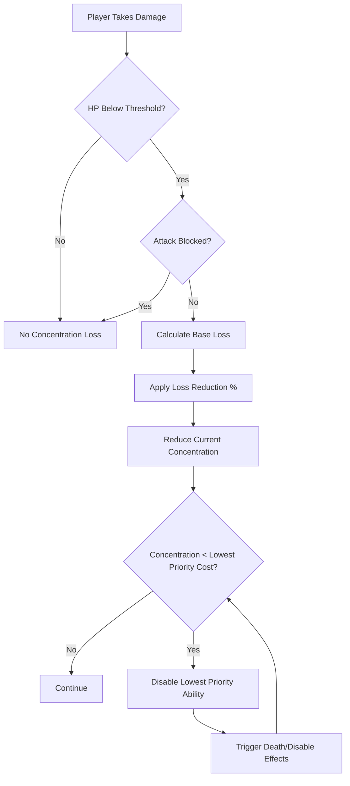
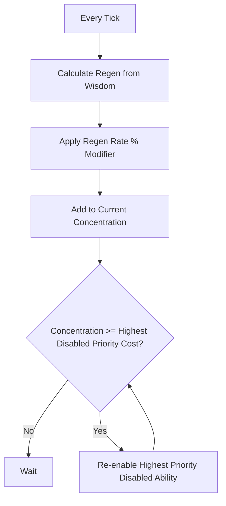
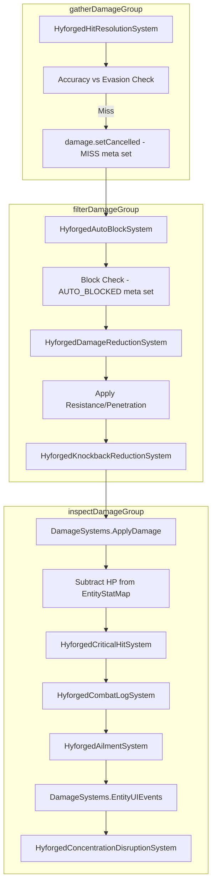

# Feature Spec: Concentration Disruption System

## Metadata
- Feature ID (slug): concentration-disruption
- Status: Draft
- Owner: JBurl
- Date: 2026-01-24

## Summary
Extend the existing Concentration resource system with a disruption mechanic where taking damage causes concentration loss, leading to automatic disabling of concentrated abilities (auras, minions, heralds). The system includes Wisdom-based regeneration, a player-configurable priority queue for ability ordering, and new stats for customizing disruption behavior. This creates tactical depth around maintaining concentration in combat and enables future "on minion death" mechanics.

## Goals
- Implement concentration loss on damage when HP falls below a configurable threshold
- Add Wisdom-derived concentration regeneration (always active)
- Create a priority queue system for concentrated abilities with manual reordering
- Introduce new stats: Concentration Regeneration Rate %, Concentration Loss Reduction %, Concentration Loss Threshold
- Provide buffs/debuffs and item affixes for the new stats
- Keep the system data-driven with no hard-coded ability types

## Non-Goals
- Implementing specific aura, herald, or minion abilities (handled by other systems)
- Client-side prediction of concentration changes (server-authoritative)
- Partial ability disable or grace periods (immediate disable only)
- Passive regeneration delay mechanics (regeneration is always active)

## User Experience

### Combat Flow


### Regeneration Flow


### Priority Queue UI
- Players see a list of all currently concentrated abilities ordered by priority
- Abilities can be reordered via UI controls (drag-and-drop when supported; arrow controls in current UI)
- Disabled abilities appear greyed out with their concentration cost shown
- As concentration regenerates, abilities re-enable from highest to lowest priority

## Functional Requirements

### Concentration Loss Mechanics
- **Trigger Condition**: Concentration loss only occurs when player HP is below `ConcentrationLossThreshold` stat (default: 75% / 7500 bps)
- **Loss Calculation**: 
  - Base loss = (Damage / Max HP) × Max Concentration
  - Effective loss = Base loss × (1 - Concentration Loss Reduction % / 10000)
- **Blocking Prevention**: If the attack was fully blocked, no concentration loss occurs
- **Immediate Effect**: When concentration drops below an ability's cost, it is immediately disabled

### Combat Pipeline Integration
- **Execution Order**: Concentration loss evaluation MUST be the **last event** in the damage evaluation flow
- **Pipeline Position**: After all other damage processing stages in the `inspectDamageGroup`:



- **System Group**: `DamageModule.get().getInspectDamageGroup()`
- **Dependencies**:
  - `Order.AFTER` → `HyforgedAilmentSystem.class` (runs after ailments are triggered)
  - `Order.AFTER` → `DamageSystems.EntityUIEvents.class` (runs after UI events)
  - No `BEFORE` dependency needed (last in chain)
  
- **Rationale**: Concentration loss depends on:
  1. Whether the attack was evaded (check `HyforgedHitResolutionSystem.MISS` meta)
  2. Whether the attack was blocked (check `HyforgedAutoBlockSystem.AUTO_BLOCKED` meta)
  3. Final damage amount after all mitigation
  4. Current HP to compare against threshold
  
- **Available Meta Keys for Integration**:
  - `HyforgedHitResolutionSystem.MISS` — `true` if attack missed (no concentration loss)
  - `HyforgedAutoBlockSystem.AUTO_BLOCKED` — `true` if auto-blocked (no concentration loss)
  - `CombatMeta.BASE_DAMAGE` — original damage before mitigation
  - `damage.getAmount()` — final damage after all mitigation
  - `damage.isCancelled()` — skip if damage was cancelled

- **Implementation Pattern**:
```java
public class HyforgedConcentrationDisruptionSystem extends DamageEventSystem {
    @Override
    public SystemGroup<EntityStore> getGroup() {
        return DamageModule.get().getInspectDamageGroup();
    }
    
    @Override
    public Set<Dependency<EntityStore>> getDependencies() {
        return Set.of(
            new SystemDependency<>(Order.AFTER, HyforgedAilmentSystem.class),
            new SystemDependency<>(Order.AFTER, DamageSystems.EntityUIEvents.class)
        );
    }
    
    @Override
    public void handle(..., Damage damage) {
        // Skip if cancelled/missed
        if (damage.isCancelled()) return;
        Boolean missed = damage.getIfPresentMetaObject(HyforgedHitResolutionSystem.MISS);
        if (Boolean.TRUE.equals(missed)) return;
        
        // Skip if blocked
        Boolean blocked = damage.getIfPresentMetaObject(HyforgedAutoBlockSystem.AUTO_BLOCKED);
        if (Boolean.TRUE.equals(blocked)) return;
        
        // Check HP threshold and apply concentration loss...
    }
}
```

### Concentration Regeneration
- **Formula**: Regen per second = Wisdom × Scaling Factor × (1 + Concentration Regeneration Rate % / 10000)
- **Scaling Factor**: TBD during implementation (suggest 0.5 or 1.0 per Wisdom point)
- **Always Active**: Regeneration occurs constantly, not just out of combat
- **Re-enable Logic**: When current concentration reaches or exceeds a disabled ability's cost, it is automatically re-enabled in priority order (highest priority first)

### Priority Queue System
- **Data Structure**: Ordered list of active/disabled concentrated abilities per entity
- **Manual Ordering**: Players can reorder via UI controls
- **Disable Order**: Lowest priority abilities disabled first when concentration is insufficient
- **Re-enable Order**: Highest priority abilities re-enabled first when concentration is sufficient
- **Persistence**: Priority order persists across sessions (saved to player data)
- **Reservation Efficiency**: `hyforged:reservation-efficiency-bps` reduces concentration costs for reserved abilities

### Ability Disable/Enable Behavior
- **Generic System**: No hard-coded logic for auras, minions, or heralds
- **Disable Trigger**: Abilities register a disable callback when concentration is insufficient
- **Enable Trigger**: Abilities register an enable callback when concentration becomes sufficient
- **Minion Death**: When a minion ability is disabled, all associated minions die (triggers on-death effects)
- **Aura Disable**: When an aura ability is disabled, the aura effect is removed from all affected entities
- **Immediate**: No grace period; abilities disable/enable on the same tick as the concentration change

### New Stats

#### Concentration Regeneration Rate (%)
- **ID**: `hyforged:concentration-regen-rate-bps`
- **Category**: `resource`
- **Description**: Increases the rate at which concentration regenerates
- **Default Value**: 0 (no bonus)
- **Tags**: Domain=resource, Mechanic=aura,minion, Type=rate

#### Concentration Loss Reduction (%)
- **ID**: `hyforged:concentration-loss-reduction-bps`
- **Category**: `defense`
- **Description**: Reduces concentration lost when taking damage
- **Default Value**: 0
- **Soft Cap**: 7500 bps (75%)
- **Hard Cap**: 10000 bps (100%) — reachable only via debuffs
- **Tags**: Domain=defense, Mechanic=aura,minion, Type=mitigation

#### Concentration Loss Threshold (%)
- **ID**: `hyforged:concentration-loss-threshold-bps`
- **Category**: `resource`
- **Description**: HP percentage below which you begin losing concentration when hit
- **Default Value**: 7500 bps (75%)
- **Tags**: Domain=resource, Mechanic=aura,minion, Type=threshold

## Buffs and Debuffs

### Buffs

| Effect ID | Name | Duration | Stats Modified |
|-----------|------|----------|----------------|
| `hyforged:focused-mind` | Focused Mind | 30s | +25% Concentration Regen Rate |
| `hyforged:iron-will` | Iron Will | 20s | +15% Concentration Loss Reduction |
| `hyforged:mental-fortress` | Mental Fortress | 15s | +10% Concentration Loss Threshold |
| `hyforged:monks-serenity` | Monk's Serenity | 60s | +20% Concentration Regen Rate, +10% Loss Reduction |

### Debuffs

| Effect ID | Name | Duration | Stats Modified |
|-----------|------|----------|----------------|
| `hyforged:mind-fog` | Mind Fog | 10s | -30% Concentration Regen Rate |
| `hyforged:psychic-scream` | Psychic Scream | 5s | -25% Concentration Loss Reduction |
| `hyforged:shattered-focus` | Shattered Focus | 8s | -15% Concentration Loss Threshold |
| `hyforged:brain-rot` | Brain Rot | 12s | -20% Concentration Regen Rate, +25% Loss Reduction penalty |

## Item Affixes

### Prefixes (Concentration Regen Rate)

| Affix ID | Name | Stat | Tiers |
|----------|------|------|-------|
| `hyforged:of-clarity` | of Clarity | Concentration Regen Rate % | T1: 15-20%, T2: 10-15%, T3: 5-10% |

### Prefixes (Concentration Loss Reduction)

| Affix ID | Name | Stat | Tiers |
|----------|------|------|-------|
| `hyforged:of-resolve` | of Resolve | Concentration Loss Reduction % | T1: 12-15%, T2: 8-12%, T3: 4-8% |

### Prefixes (Concentration Loss Threshold)

| Affix ID | Name | Stat | Tiers |
|----------|------|------|-------|
| `hyforged:steadfast` | Steadfast | Concentration Loss Threshold % | T1: 8-10%, T2: 5-8%, T3: 2-5% |

### Forged Stats (High-Tier Only)

| Affix ID | Name | Stats | Forged Only |
|----------|------|-------|-------------|
| `hyforged:mental-bastion` | Mental Bastion | +20-25% Concentration Loss Reduction, +10-15% Concentration Regen Rate | Yes |
| `hyforged:unshakeable-focus` | Unshakeable Focus | +10-12% Concentration Loss Threshold, +15-20% Concentration Regen Rate | Yes |

## Non-Functional Requirements
- **Performance**: Concentration calculations occur on damage events, not per-tick scans
- **Server Authority**: All concentration changes computed server-side
- **Determinism**: Same damage input produces same concentration loss output
- **Data-Driven**: Ability types (aura, minion, herald) not hard-coded; behavior defined by ability registration

## Dependencies
- Hyforged Stats System (stat definitions, modifiers)
- Hyforged Combat System (damage events, block detection)
- Resource Stats UI (concentration bar display) — existing
- Hytale EntityEffect system (buff/debuff display)
- Player data persistence (priority queue storage)

## Data/Schema Impact

### New Stat Definitions
- `Server/Hyforged/Stats/Definitions/ConcentrationRegenRate.json`
- `Server/Hyforged/Stats/Definitions/ConcentrationLossReduction.json`
- `Server/Hyforged/Stats/Definitions/ConcentrationLossThreshold.json`

### New Effect Definitions
- `Server/Hyforged/Effects/Buffs/FocusedMind.json`
- `Server/Hyforged/Effects/Buffs/IronWill.json`
- `Server/Hyforged/Effects/Buffs/MentalFortress.json`
- `Server/Hyforged/Effects/Buffs/MonksSerenity.json`
- `Server/Hyforged/Effects/Debuffs/MindFog.json`
- `Server/Hyforged/Effects/Debuffs/PsychicScream.json`
- `Server/Hyforged/Effects/Debuffs/ShatteredFocus.json`
- `Server/Hyforged/Effects/Debuffs/BrainRot.json`
- Hyforged effect assets may optionally include concentration reservation metadata:
  - `ConcentrationCost` (int)
  - `ConcentrationAbilityId` (string, optional override)
  - `ConcentrationPriority` (int, optional override)

### New Affix Definitions
- `Server/Hyforged/Affixes/Definitions/Prefix/OfClarity.json`
- `Server/Hyforged/Affixes/Definitions/Prefix/OfResolve.json`
- `Server/Hyforged/Affixes/Definitions/Prefix/Steadfast.json`
- `Server/Hyforged/Affixes/Definitions/Forged/MentalBastion.json`
- `Server/Hyforged/Affixes/Definitions/Forged/UnshakeableFocus.json`

### Component Changes
- New `ConcentrationPriorityComponent` for storing ability priority queue per entity
- Extend `HyforgedStatComponent` to track current concentration value (if not already)

## API Changes
- `ConcentrationService.reserveConcentration(entityRef, abilityId, cost, callbacks)` — register a concentrated ability
- `ConcentrationService.releaseConcentration(entityRef, abilityId)` — manually release concentration
- `ConcentrationService.setPriority(entityRef, abilityId, priority)` — set ability priority
- `ConcentrationService.getPriorityQueue(entityRef)` — get ordered list of concentrated abilities
- `ConcentrationService.onDamage(entityRef, damage, wasBlocked)` — called by combat system

## Security/Privacy
- Server-authoritative; client cannot spoof concentration values
- Priority queue changes validated server-side

## Observability
- Log concentration loss events at DEBUG level
- Log ability disable/enable events at INFO level
- Metrics for average concentration loss per hit (balance tuning)

## Risks
- **Balance Complexity**: Concentration loss + regeneration + priority creates complex interactions
- **UI Complexity**: Priority queue UI requires client-side implementation
- **Death Cascade**: Losing all minions at once may feel punishing; consider future "minion death" mechanics
- **Wisdom Scaling**: If Wisdom scaling is too high, regeneration may trivialize the mechanic

## Open Questions
- [x] ~~What HP threshold triggers concentration loss?~~ — 75% (configurable via stat)
- [x] ~~How is regeneration calculated?~~ — Derived from Wisdom, always active
- [x] ~~How are abilities prioritized?~~ — Manual UI ordering
- [x] ~~What happens to minions on disable?~~ — They die, triggering on-death effects
- [x] **Wisdom Scaling Factor**: Default 0.5 via regeneration config.
- [x] **Priority Queue Persistence**: Stored in the concentration priority component with persistence.
- [x] **UI Implementation**: Custom UI page with priority queue controls

## Acceptance Criteria
- [x] Concentration loss triggers only when HP < Concentration Loss Threshold
- [x] Concentration loss is proportional to damage % of max HP, applied to max concentration
- [x] Concentration Loss Reduction % reduces the amount lost (soft cap 75%)
- [x] Blocked attacks do not cause concentration loss
- [x] Concentration regenerates based on Wisdom × Scaling × (1 + Regen Rate %)
- [x] Abilities disable immediately when concentration is insufficient
- [x] Abilities re-enable automatically in priority order when concentration is sufficient
- [x] Priority queue is manually reorderable via UI
- [x] Minions die when their ability is disabled (triggers on-death effects)
- [x] New stats are defined in JSON and registered with the stats system
- [x] Buffs and debuffs modify the new stats correctly
- [x] Item affixes (prefix and forged) are defined and apply to items

## Impacted Areas (High-Level)
- `reign.software.hyforged.stats` — new stat definitions
- `reign.software.hyforged.combat` — damage event integration for concentration loss
- `reign.software.hyforged.concentration` — new service and components (proposed)
- `reign.software.hyforged.affix` — new affix definitions
- `Server/Hyforged/Stats/Definitions/` — new stat JSON files
- `Server/Hyforged/Effects/` — new buff/debuff JSON files
- `Server/Hyforged/Affixes/Definitions/` — new affix JSON files
- UI components — priority queue display and reordering

## Required Codebase/Architecture Changes (High-Level)

### New Systems (ECS)
- **`HyforgedConcentrationDisruptionSystem`** — `DamageEventSystem` in `inspectDamageGroup`
  - Dependencies: `AFTER HyforgedAilmentSystem`, `AFTER DamageSystems.EntityUIEvents`
  - Reads: `HyforgedHitResolutionSystem.MISS`, `HyforgedAutoBlockSystem.AUTO_BLOCKED` meta keys
  - Reads: `damage.getAmount()` for final damage, defender HP from `EntityStatMap`
  - Writes: Updates concentration in `HyforgedStatComponent` or custom component
  - Triggers: Ability disable callbacks via `ConcentrationService`

- **`HyforgedConcentrationRegenerationSystem`** — `TickingSystem` (global tick)
  - Calculates regen per tick based on Wisdom stat
  - Applies `concentration-regen-rate-bps` modifier
  - Triggers ability re-enable callbacks via `ConcentrationService`

### New Components (ECS)
- **`ConcentrationPriorityComponent`** — Stores ordered list of concentrated abilities per entity
  - Fields: `List<ConcentratedAbility>` (abilityId, cost, priority, enabled, callbacks)
  - Persistence: Serializable to player data

### New Services
- **`ConcentrationService`** — API for ability registration and priority management
  - `reserveConcentration(entityRef, abilityId, cost, onDisable, onEnable)`
  - `releaseConcentration(entityRef, abilityId)`
  - `setPriority(entityRef, abilityId, priority)`
  - `getPriorityQueue(entityRef)`
  - `applyConcentrationLoss(entityRef, lossAmount)` — called by disruption system
  - `tickRegeneration(entityRef)` — called by regen system

### New Stats (JSON)
- `Server/Hyforged/Stats/Definitions/ConcentrationRegenRate.json`
- `Server/Hyforged/Stats/Definitions/ConcentrationLossReduction.json`
- `Server/Hyforged/Stats/Definitions/ConcentrationLossThreshold.json`

### New Effects (JSON)
- `Server/Hyforged/Effects/Buffs/FocusedMind.json`
- `Server/Hyforged/Effects/Buffs/IronWill.json`
- `Server/Hyforged/Effects/Buffs/MentalFortress.json`
- `Server/Hyforged/Effects/Buffs/MonksSerenity.json`
- `Server/Hyforged/Effects/Debuffs/MindFog.json`
- `Server/Hyforged/Effects/Debuffs/PsychicScream.json`
- `Server/Hyforged/Effects/Debuffs/ShatteredFocus.json`
- `Server/Hyforged/Effects/Debuffs/BrainRot.json`

### New Affixes (JSON)
- `Server/Hyforged/Affixes/Definitions/Prefix/OfClarity.json`
- `Server/Hyforged/Affixes/Definitions/Prefix/OfResolve.json`
- `Server/Hyforged/Affixes/Definitions/Prefix/Steadfast.json`
- `Server/Hyforged/Affixes/Definitions/Forged/MentalBastion.json`
- `Server/Hyforged/Affixes/Definitions/Forged/UnshakeableFocus.json`

### Plugin Registration (HyforgedPlugin.java)
- Register `ConcentrationPriorityComponent` with `EntityStoreRegistry`
- Register `HyforgedConcentrationDisruptionSystem` in `registerCombatSystems()`
- Register `HyforgedConcentrationRegenerationSystem` as ticking system
- Initialize `ConcentrationService` singleton

### UI Integration
- Concentration priority queue page with reorder controls and command access

## References
- Requirements: .memory_bank/Requirements/rpg-arpg/README.md
- Related Specs:
  - [resource-stats-ui.spec.md](../resource-stats-ui/resource-stats-ui.spec.md) — Concentration bar display
  - [combat-system.spec.md](../combat-system/combat-system.spec.md) — Damage event integration
- Related ADRs:
  - ADR-0001: Hybrid Hyforged + Hytale Stats
  - ADR-0006: Replace Hytale Stat/Damage Systems
- PoE2 Spirit mechanic (inspiration for reservation model)
