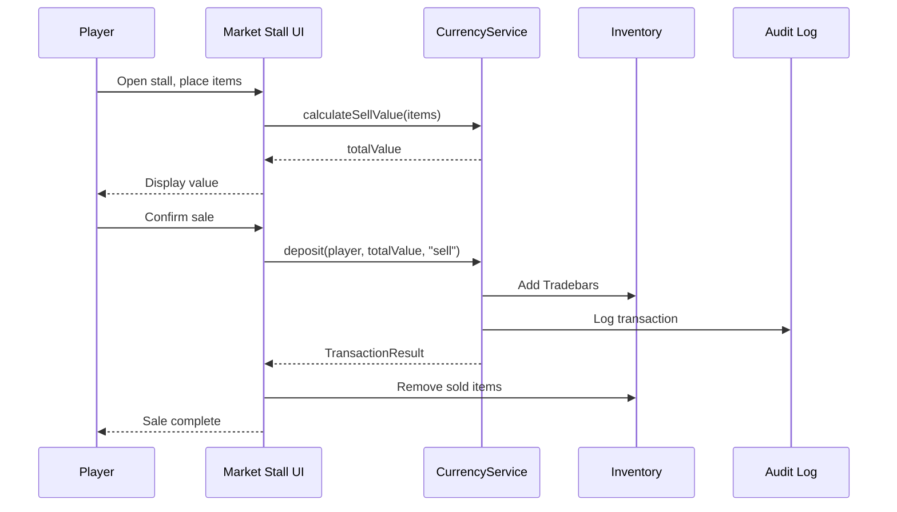
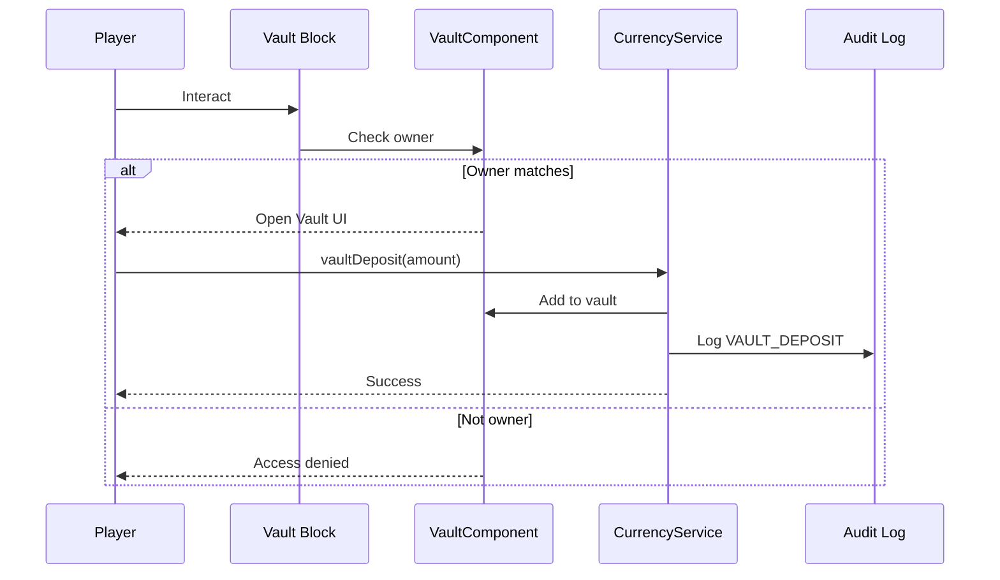

# Feature Spec: Currency System (Tradebars)

## Metadata
- Feature ID (slug): currency-tradebars
- Status: Draft
- Owner: JBurl
- Date: 2026-01-27

## Summary
Tradebars are the core ARPG currency for Hyforged. They exist as a stackable inventory item (up to 10,000 per slot), can be stored in upgradable vault blocks, and serve as the universal medium for passive refunds, enchanting, forging, and player trading. All currency operations are server-authoritative with full audit logging.

## Goals
- Provide a single, fungible currency item that integrates with all economy sinks.
- Enable secure, upgradable vault storage for large Tradebar quantities.
- Support data-driven sell values with rarity/affix-based calculation and optional per-item overrides.
- Introduce a Market Stall block for selling items at calculated market prices.
- Ensure all transactions are atomic, server-authoritative, and fully auditable.

## Non-Goals
- Multiple parallel currencies (Tradebars only at launch).
- Tradebars dropping from combat (chests and selling only).
- Client-side authoritative currency representation.
- Pouch system (removed in favor of vault-only extended storage).

## User Experience

### Earning Tradebars
1. **Chest Loot**: Players discover Tradebars in world chests. Quantity and frequency are data-driven per chest type.
2. **Selling Items**: Players interact with a Market Stall block to sell items. The stall displays the calculated sell value before confirming. Tradebars are added directly to inventory (or vault if inventory full and vault is linked—future feature).

### Spending Tradebars
1. **Passive Refunds**: When refunding passive tree nodes, the cost (calculated per character level) is deducted from inventory Tradebars.
2. **Enchanting/Forging**: Crafting UIs display Tradebar costs; transactions deduct from inventory.
3. **Trading Fees**: Optional configurable fee for player-to-player trades (future).

### Storage
1. **Inventory**: Tradebars stack up to 10,000 per slot in regular inventory.
2. **Vault Block**: Players place a Tradebar Vault block. Only the owner can access or destroy it. Vault capacity starts at a base value and can be upgraded via crafting. Vault UI shows current amount, capacity, and upgrade path.

### Market Stall
1. Player places a Market Stall block.
2. Player interacts to open the sell UI.
3. Player drags items into sell slots; UI displays calculated Tradebar value per item.
4. Player confirms sale; items are consumed, Tradebars are added to inventory.
5. (Future) Other players can view listed items for purchase.

## Functional Requirements

### FR-1: Tradebar Item Definition
- Define `hyforged:tradebar` item in `Server/Hyforged/Items/`.
- `MaxStack`: 10000.
- Categories: `Items.Currency`, `Items.Hyforged`.
- Quality: Common (no affixes).
- Non-consumable, non-equipable.
- Icon and model assets required.

### FR-2: Tradebar Vault Block
- Define `hyforged:tradebar_vault` block with associated item.
- Vault is a single-owner container that stores only Tradebars.
- Owner is set on placement (player UUID).
- Only owner can:
  - Open vault UI.
  - Deposit/withdraw Tradebars.
  - Destroy the block.
- Other players cannot destroy the vault block (block break prevention).
- Vault data persists with the chunk/world.

### FR-3: Vault Upgrades (Data-Driven)
- Define `Server/Hyforged/Config/VaultUpgrades.json` with upgrade tiers:
  ```json
  {
    "Tiers": [
      { "Tier": 1, "Capacity": 50000, "UpgradeCost": 0, "UpgradeItem": null },
      { "Tier": 2, "Capacity": 100000, "UpgradeCost": 5000, "UpgradeItem": "hyforged:vault_upgrade_1" },
      { "Tier": 3, "Capacity": 250000, "UpgradeCost": 15000, "UpgradeItem": "hyforged:vault_upgrade_2" },
      { "Tier": 4, "Capacity": 500000, "UpgradeCost": 50000, "UpgradeItem": "hyforged:vault_upgrade_3" }
    ]
  }
  ```
- Vault UI displays current tier, capacity, stored amount, and upgrade button (if eligible).
- Upgrade consumes Tradebars and optional upgrade item from player inventory.

### FR-4: Sell Value Calculation
- Default formula: `baseSellValue + (rarityMultiplier × baseValue) + (affixValue × affixCount)`.
- Configurable via `Server/Hyforged/Config/SellValueConfig.json`:
  ```json
  {
    "BaseValue": 1,
    "RarityMultipliers": {
      "Junk": 0,
      "Common": 1,
      "Uncommon": 2,
      "Rare": 5,
      "Epic": 15,
      "Legendary": 50
    },
    "AffixValuePerTier": {
      "1": 100,
      "2": 50,
      "3": 25,
      "4": 10,
      "5": 5
    },
    "MinSellValue": 1
  }
  ```
- Per-item override: Items can define `"SellValue": <int>` in their JSON to bypass calculation.
- Items with `"Sellable": false` cannot be sold.

### FR-5: Market Stall Block
- Define `hyforged:market_stall` block with associated item.
- Interaction opens a sell UI with item slots.
- UI displays calculated sell value for each item.
- Confirm button executes atomic transaction:
  1. Validate items still in slots.
  2. Calculate total Tradebar value.
  3. Remove items from player inventory.
  4. Add Tradebars to player inventory.
  5. Log transaction.
- (Future) Stall can list items for other players to browse/purchase.

### FR-6: Currency Service API
- `CurrencyService` singleton with methods:
  - `int getBalance(Ref<EntityStore> player)` — Total Tradebars in inventory.
  - `int getVaultBalance(Ref<EntityStore> player, BlockPos vaultPos)` — Tradebars in a specific vault.
  - `TransactionResult deduct(Ref<EntityStore> player, int amount, String reason)` — Deduct from inventory.
  - `TransactionResult deposit(Ref<EntityStore> player, int amount, String reason)` — Add to inventory.
  - `TransactionResult vaultDeposit(Ref<EntityStore> player, BlockPos vault, int amount)` — Move from inventory to vault.
  - `TransactionResult vaultWithdraw(Ref<EntityStore> player, BlockPos vault, int amount)` — Move from vault to inventory.
  - `int calculateSellValue(ItemStack item)` — Calculate Tradebar value for an item.
- All methods return `TransactionResult` with success/failure, before/after balances, and transaction ID.

### FR-7: Transaction Atomicity
- All currency operations use atomic transactions.
- If any step fails (e.g., insufficient space), the entire transaction rolls back.
- No partial state changes allowed.

### FR-8: Audit Logging
- Every transaction logs:
  - Timestamp (ISO 8601).
  - Transaction ID (UUID).
  - Player UUID.
  - Transaction type (EARN, SPEND, VAULT_DEPOSIT, VAULT_WITHDRAW, SELL).
  - Amount.
  - Balance before.
  - Balance after.
  - Reason/source (e.g., "passive_refund", "chest_loot", "sell:Sword_Iron").
- Logs written to `logs/hyforged/currency_audit.log` with daily rotation.
- Rate limiting: Aggregate repeated small transactions within 1 second window.

### FR-9: Passive Refund Integration
- Update `PassiveTreeService.refundNode()` to call `CurrencyService.deduct()`.
- If deduction fails, refund fails with `REASON_INSUFFICIENT_TRADEBARS`.
- Remove existing TODO comments in `PassiveTreeService`.

### FR-10: Chest Loot Integration
- Tradebars can appear in chest loot tables via standard Hytale drops JSON.
- Example drop entry:
  ```json
  { "ItemId": "hyforged:tradebar", "Quantity": { "Min": 10, "Max": 50 } }
  ```

## Non-Functional Requirements

### NFR-1: Performance
- Currency operations are O(1) per transaction.
- Inventory scanning for Tradebar count uses cached totals where possible.
- Vault access does not require loading entire chunk data.

### NFR-2: Security
- All currency state is server-authoritative.
- Client cannot request arbitrary currency changes.
- Vault ownership validated on every access attempt.
- Block break events checked against ownership before allowing destruction.

### NFR-3: Reliability
- Transaction atomicity prevents duplication exploits.
- Audit log is append-only and crash-safe (flush on write).
- Vault data saved with chunk; survives server restarts.

### NFR-4: Extensibility
- Sell value config supports future rarity types.
- Vault upgrade tiers are fully data-driven.
- `CurrencyService` API allows future sinks (trading fees, taxes, etc.).

## Dependencies
- **Stats System**: Not directly required, but passive refunds depend on character level.
- **Passive Trees**: Integration for refund cost deduction.
- **Item System**: Affixes and rarity for sell value calculation.
- **Block System**: Vault and Market Stall block placement/interaction.
- **Hytale Drops System**: For chest loot tables.

## Data/Schema Impact

### New JSON Assets
| Path | Description |
|------|-------------|
| `Server/Hyforged/Items/Tradebar.json` | Tradebar item definition |
| `Server/Hyforged/Items/Vault_Upgrade_1.json` | Vault upgrade item (Tier 2) |
| `Server/Hyforged/Items/Vault_Upgrade_2.json` | Vault upgrade item (Tier 3) |
| `Server/Hyforged/Items/Vault_Upgrade_3.json` | Vault upgrade item (Tier 4) |
| `Server/Hyforged/Items/Tradebar_Vault.json` | Vault block item |
| `Server/Hyforged/Items/Market_Stall.json` | Market Stall block item |
| `Server/Hyforged/Config/VaultUpgrades.json` | Vault tier configuration |
| `Server/Hyforged/Config/SellValueConfig.json` | Sell value formula configuration |

### New Components
| Component | Store | Description |
|-----------|-------|-------------|
| `TradebarVaultComponent` | ChunkStore | Stores vault data (owner UUID, tier, amount) |

### Player Data
- No new player component needed; Tradebars are inventory items.
- Vault ownership stored on the block, not the player.

## API Changes

### New Service: `CurrencyService`
```java
public interface CurrencyService {
    int getBalance(Ref<EntityStore> player);
    int getVaultBalance(Ref<EntityStore> player, BlockPos vaultPos);
    TransactionResult deduct(Ref<EntityStore> player, int amount, String reason);
    TransactionResult deposit(Ref<EntityStore> player, int amount, String reason);
    TransactionResult vaultDeposit(Ref<EntityStore> player, BlockPos vault, int amount);
    TransactionResult vaultWithdraw(Ref<EntityStore> player, BlockPos vault, int amount);
    int calculateSellValue(ItemStack item);
}
```

### New Record: `TransactionResult`
```java
public record TransactionResult(
    boolean success,
    String transactionId,
    int balanceBefore,
    int balanceAfter,
    String failureReason
) {
    public static TransactionResult success(String txId, int before, int after);
    public static TransactionResult failure(String reason, int balance);
}
```

## Security/Privacy
- Player UUIDs are logged in audit; no PII beyond game identity.
- Audit logs should be access-controlled on the server filesystem.
- Vault ownership prevents unauthorized access but does not encrypt data.

## Observability
- **Metrics**: Total Tradebars in circulation (periodic aggregation).
- **Alerts**: Unusual transaction volume (potential exploit detection).
- **Logging**: Full audit trail per FR-8.
- **Admin Commands**:
  - `/hyforged currency balance <player>` — View player Tradebar balance.
  - `/hyforged currency grant <player> <amount>` — Admin grant (logged as ADMIN_GRANT).
  - `/hyforged currency audit <player> [count]` — View recent transactions.

## Risks

| Risk | Likelihood | Impact | Mitigation |
|------|------------|--------|------------|
| Duplication exploit via race condition | Medium | High | Atomic transactions, single-threaded currency operations per player |
| Vault griefing (blocking access) | Low | Medium | Prevent non-owner destruction; future: decay timer for abandoned vaults |
| Inflation from excessive chest loot | Medium | Medium | Balance loot tables; monitor circulation metrics |
| Sell value abuse (crafting for profit) | Low | Medium | Ensure crafting costs exceed sell value of outputs |

## Open Questions
- ~~Should vaults link to player for overflow deposits?~~ Deferred to future feature.
- Should Market Stall support listing items for purchase by other players at launch? **Deferred** — sell-only at launch.
- What is the Tradebar icon/model design? **TBD** — placeholder assets initially.

## Acceptance Criteria
- [ ] Tradebar item defined with 10,000 stack size, spawnable via creative/commands.
- [ ] Tradebars appear in test chest loot table.
- [ ] Vault block placeable; only owner can open/destroy.
- [ ] Vault upgrade tiers load from JSON config.
- [ ] Vault UI shows balance, capacity, deposit/withdraw buttons.
- [ ] Market Stall block opens sell UI.
- [ ] Sell UI calculates and displays item values correctly.
- [ ] Selling items grants Tradebars to inventory.
- [ ] Passive refund deducts Tradebars; fails if insufficient.
- [ ] All transactions logged to audit file with required fields.
- [ ] Non-owner players cannot destroy vault blocks.
- [ ] `CurrencyService` API methods work as specified.

## Impacted Areas (High-Level)
- **Passive Tree System**: Refund cost deduction integration.
- **Item System**: Sell value metadata, Market Stall interaction.
- **Block System**: Vault and Market Stall block definitions.
- **Drops System**: Tradebar chest loot entries.
- **UI System**: Vault UI, Market Stall sell UI.

## Required Codebase/Architecture Changes (High-Level)
1. **New Items**: Tradebar, Vault Upgrades (×3), Vault Block, Market Stall Block.
2. **New Blocks**: `hyforged:tradebar_vault`, `hyforged:market_stall` with custom interactions.
3. **New Component**: `TradebarVaultComponent` for ChunkStore.
4. **New Service**: `CurrencyService` singleton with transaction logic.
5. **New Config Assets**: `VaultUpgrades.json`, `SellValueConfig.json`.
6. **Audit Logger**: Dedicated currency audit log with rotation.
7. **PassiveTreeService Update**: Integrate `CurrencyService.deduct()` for refunds.
8. **Block Break Prevention**: System to prevent non-owner vault destruction.
9. **UI Files**: `.ui` files for Vault and Market Stall interfaces.

## References
- Requirements: [.memory_bank/Requirements/rpg-arpg/currency-tradebars.md](../../Requirements/rpg-arpg/currency-tradebars.md)
- Related: [Passive Trees Spec](../passive-trees/passive-trees.spec.md) (refund integration)
- Related: [Items Affix System Spec](../items-affix-system/items-affix-system.spec.md) (sell value calculation)

---

## Diagrams

### Sell Flow


### Vault Interaction Flow

