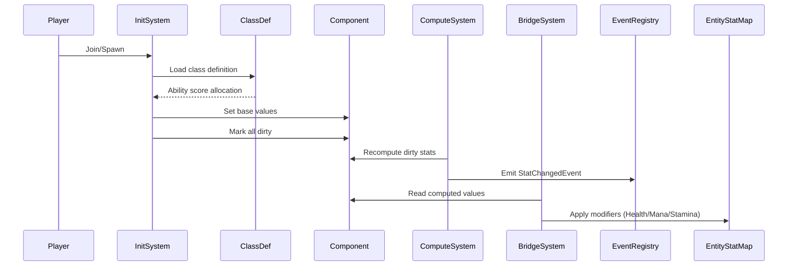
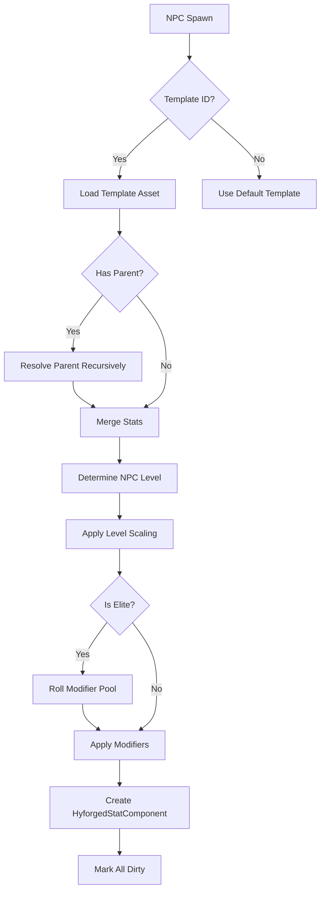
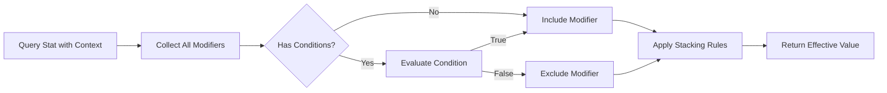

# Feature Spec: Entity Stats

## Metadata
- Feature ID (slug): entity-stats
- Status: Approved
- Owner: JBurl
- Date: 2026-01-19

## Summary
Attach Hyforged stat containers to players and NPCs, enabling source aggregation, lifecycle management, recalculation triggers, and context-aware modifiers. Builds on the Stats System (Phase 1) to provide the foundational entity-level stat infrastructure for all subsequent systems (Experience, Class, Items, Combat, Passives).

This feature extends the existing `HyforgedStatComponent` implementation to support:
- Data-driven NPC stat templates with level scaling
- Player stat initialization with class-based ability score distribution
- Stat change events via Hytale's `EventRegistry`
- Context-aware modifier queries for self-affecting conditions
- Additional damage types to support ARPG stats

## Goals
- Provide a single source of truth for any entity's current stats via `HyforgedStatComponent`.
- Support data-driven NPC stat templates in JSON (`Server/Hyforged/Stats/NPCTemplates/`).
- Enable level-based scaling formulas for NPC stats (e.g., `baseHealth + level * healthPerLevel`). Note: NPC level scaling is independent of player level mechanics.
- Initialize player ability scores automatically based on class (default value = 1 for all stats).
- **Player stats do NOT scale with character level**. Character level grants passive points and is used for combat rating calculations.
- **Attributes are gained through class leveling** (deferred to Class System), not character level.
- Aggregate modifiers from equipment, buffs, passives, and class sources.
- Emit stat change events using Hytale's `EventRegistry` for UI updates, combat debuff handling, and plugin extensibility.
- Support context-aware modifiers for self-affecting conditions (e.g., "while bleeding," "when health below 50%").
- Extend Hytale damage types to cover ARPG stats (Chaos, Bleed, additional elemental variants).
- Ensure full moddability: all templates, scaling, and damage types are JSON-configurable.

## Non-Goals
- Combat formulas that affect other entities (deferred to Combat System spec).
- Per-stat custom scripting logic.
- Client-side stat containers; server remains authoritative.
- Ability score respec UI (may be added in a future feature).

## User Experience
- **Players** see their stats populate correctly on join/respawn.
- **NPCs** spawn with stats scaled to their level and template.
- **Other plugins** can subscribe to stat change events and apply/query modifiers via API.
- **Mod developers** can define custom NPC stat templates, add new damage types, and create new modifier sources via JSON.

## Functional Requirements

### FR-1: NPC Stat Templates
- NPC stat templates are JSON assets in `Server/Hyforged/Stats/NPCTemplates/`.
- Templates follow Hytale's `Type: "Abstract"` / `Parameters` / `Compute` pattern.
- Templates support:
  - Base stat values (e.g., `"MaxHealth": 100`).
  - Level scaling formulas (e.g., `"MaxHealth": { "Base": 100, "PerLevel": 10 }`).
  - Modifier pools for elite/boss variants (list of potential modifiers, random selection on spawn).
  - Inheritance from parent templates (`"Parent": "Template_Predator"`).
- On NPC spawn:
  - Resolve NPC level from region difficulty, spawn group, or template override.
  - Instantiate `HyforgedStatComponent` with scaled base values.
  - Apply any template-defined modifiers (e.g., elite affixes).
  - Mark all stats dirty for initial computation.

### FR-2: Player Stat Initialization
- All stats default to 1 (not 10) as the baseline.
- On player join/spawn:
  - Initialize `HyforgedStatComponent` with class-based ability score distribution.
  - Class defines base ability score allocation (e.g., Warrior: STR 5, CON 3, DEX 2, others 1).
  - Additional points come from items, buffs, passives, and level-up bonuses.
- Player-allocated points are persisted; computed stats are not persisted.
- Class definitions are JSON assets in `Server/Hyforged/Stats/Classes/`.

### FR-3: Source Aggregation
- Modifiers are aggregated in the following source order:
  1. Base values (template or class-allocated ability scores)
  2. Class bonuses (from class level and identity — attributes gained here)
  3. Equipment (worn items and their affixes)
  4. Passive tree allocations
  5. Buffs and debuffs (temporary modifiers)
  6. Environmental/situational modifiers
- **Character level does NOT contribute stat bonuses**. Level is used for:
  - Granting passive points (Passive Tree system, not yet implemented)
  - Combat rating calculations (e.g., accuracy vs evasion formulas)
- Each modifier is tagged with its `ModifierSource` for UI breakdown.
- Modifiers are stored with stable source keys; reapplying the same source refreshes/overwrites rather than stacking.

### FR-4: Stat Recalculation Triggers
- Recalculation is triggered by:
  - Equipment equipped/unequipped
  - Buff/debuff applied/expired
  - Passive node allocated/deallocated
  - Class level up or class change (weapon swap) — grants attribute bonuses
  - Environmental modifier zone enter/exit
- **Character level up does NOT trigger stat recalculation** (level grants passive points, not stats).
- Batch recalculations when multiple changes occur in the same tick (existing dirty-flag model).
- `HyforgedStatComputeSystem` handles recalculation in topological order.

### FR-5: Stat Change Events
- Define `StatChangedEvent` emitted via Hytale's `EventRegistry`.
- **Batch mode**: Events are coalesced per entity per tick to reduce spam during bulk operations.
  - `StatBatchChangedEvent` contains a list of all stat changes for an entity in a single tick.
  - Individual `StatChangedEvent` is still available for fine-grained subscriptions.
- Event payload (per stat change):
  - Entity reference
  - Stat ID
  - Old value
  - New value
  - Source of change (if identifiable)
- Systems can subscribe to:
  - Batch events (recommended for UI, performance-sensitive systems)
  - Individual stat changes (for specific stat monitoring)
- UI system subscribes to batch events to update character sheet and tooltips.
- Combat system subscribes for debuff expiration and conditional effects.

### FR-6: Context-Aware Modifiers (Self-Affecting)
- Modifiers can declare conditions for when they apply:
  - **State-based**: "while bleeding," "when poisoned," "while stunned"
  - **Health-based**: "when health below X%"
  - **Equipment-based**: "while wielding a sword," "while shield equipped"
- Context is resolved at stat query time, not modifier application time.
- Only self-affecting conditions are in scope (conditions affecting combat outcomes against other entities are deferred to Combat System).
- Context descriptor passed to stat queries for evaluation.

### FR-7: Damage Type Extensions
- **Use Hytale's base damage types** where they exist (Physical, Fire, Ice, Poison, Elemental, etc.).
- **Add new damage types** to `Server/Hyforged/Stats/Damage/` only for types not in base Hytale:
  - `Chaos.json` — non-elemental magic damage that bypasses resistances differently
  - `Bleed.json` — physical damage over time
  - `Lightning.json` — explicit lightning damage (Hytale has Ice but not explicit Lightning)
- Extend base types by inheriting from them (e.g., `"Parent": "Elemental"`).
- Damage types reference Hyforged stats for resistance/penetration.
- Damage types are JSON assets following Hytale's `Entity/Damage/` pattern.
- Do not duplicate existing Hytale damage types; integrate with them.

### FR-8: API Surface
- `HyforgedStatComponent` provides:
  - `getEffectiveValue(StatId)` — cached computed value
  - `getEffectiveValue(StatId, Context)` — with context for conditional modifiers
  - `getBreakdown(StatId)` — source-attributed breakdown
  - `addModifier(StatModifier)` / `removeModifier(String sourceId)` — idempotent
  - `setBaseValue(StatId, int)` — for ability score allocation
- `StatDefinitionRegistry` provides:
  - `getStat(StatId)` — definition lookup
  - `getStatsByTag(String tag)` — tag-based lookup
- Event registration via `plugin.getEventRegistry().register(StatChangedEvent.class, ...)`.

### FR-9: NPC Template Asset Loader
- Register `NPCStatTemplateAsset` store at `Server/Hyforged/Stats/NPCTemplates/`.
- Load templates on asset load event.
- Validate template inheritance and scaling formula syntax.
- Provide API to resolve template by ID and apply to entity.

## Non-Functional Requirements

### NFR-1: Performance
- Stat containers use dirty-flag caching; recompute only changed stats.
- Bulk operations (e.g., loading player with 20 equipment pieces) batch into a single recalculation pass.
- Maximum 256 modifiers per entity (existing guard); graceful degradation if exceeded.
- Context-aware queries cache condition evaluations within a tick.

### NFR-2: Extensibility
- All stat sources, templates, and damage types are JSON-configurable.
- Other mods can add NPC templates, damage types, and modifier sources without code changes.
- Event-based architecture allows plugins to react to stat changes.

### NFR-3: Data-Driven Moddability
- NPC stat templates: `Server/<ModName>/Stats/NPCTemplates/*.json`
- Class definitions: `Server/<ModName>/Stats/Classes/*.json`
- Damage types: `Server/<ModName>/Stats/Damage/*.json`
- Asset conflict resolution: first definition wins (core Hyforged loads first).

### NFR-4: Observability
- Log stat recalculation counts per tick (debug level).
- Log modifier application/removal with source attribution.
- `StatDebugTracer` provides detailed breakdown for admin commands.

## Dependencies
- **Stats System** (Phase 1) — stat definitions, modifier model, scaling engine, stacking engine
- **Hytale ECS** — `HyforgedStatComponent`, systems, `EntityStore`
- **Hytale Events** — `EventRegistry`, `IEvent` pattern
- **Hytale Assets** — `AssetRegistry`, `JsonAsset`, `IndexedLookupTableAssetMap`
- **Hytale Entity Stats** — `EntityStatMap` for bridge system

## Data/Schema Impact
- New asset type: `NPCStatTemplateAsset` at `Server/Hyforged/Stats/NPCTemplates/`
- New asset type: `ClassDefinitionAsset` at `Server/Hyforged/Stats/Classes/` (placeholder for Class System)
- New damage type assets at `Server/Hyforged/Stats/Damage/`
- `HyforgedStatComponent` schema unchanged (v2)

### NPC Stat Template Schema
```json
{
  "Id": "hyforged:npc-skeleton-warrior",
  "Type": "Template",
  "Parent": "hyforged:npc-base-hostile",
  "Parameters": {
    "Level": { "Value": 1, "Description": "Base NPC level" }
  },
  "Stats": {
    "hyforged:max-health-flat": { "Base": 50, "PerLevel": 15 },
    "hyforged:armor-rating": { "Base": 10, "PerLevel": 2 },
    "hyforged:attack-power": { "Base": 5, "PerLevel": 1 }
  },
  "ModifierPools": {
    "Elite": [
      { "Stat": "hyforged:max-health-flat", "Type": "INCREASED", "Value": 5000 },
      { "Stat": "hyforged:damage-increased-bps", "Type": "INCREASED", "Value": 2000 }
    ]
  }
}
```

### Damage Type Schema
```json
{
  "Id": "Hyforged_Chaos",
  "Parent": "Physical",
  "DurabilityLoss": true,
  "StaminaLoss": true,
  "DamageTextColor": "#AA00FF",
  "ResistanceStat": "hyforged:chaos-resistance",
  "PenetrationStat": "hyforged:chaos-penetration"
}
```

## API Changes
- New event: `StatChangedEvent` in `reign.software.hyforged.stats.event`
- New asset types: `NPCStatTemplateAsset`, `ClassDefinitionAsset`
- New loader: `NPCStatTemplateLoader`
- Extended `HyforgedStatComponent`: `getEffectiveValue(StatId, Context)` overload

## Security/Privacy
- All stat computation is server-authoritative.
- No client-provided stat values are trusted.
- Admin commands for stat manipulation require appropriate permissions.

## Observability
- Stat change events can be logged for debugging.
- `StatMetrics` tracks recalculation frequency and modifier counts.
- Admin command `/hyforged stats debug <player>` shows full breakdown.

## Risks

| Risk | Impact | Mitigation |
|------|--------|------------|
| Performance regression with many conditional modifiers | Medium | Cache condition evaluations per tick; limit condition complexity |
| Template inheritance cycles | Low | Validate DAG at asset load time; reject cycles |
| Damage type conflicts with other mods | Low | First-definition-wins policy; log conflicts |
| Stat change event spam during bulk operations | Medium | Coalesce events per entity per tick |

## Open Questions
- ~~How should NPC level be determined?~~ Resolved: region difficulty, spawn group, or template override
- ~~Should ability scores default to 1 or 10?~~ Resolved: 1
- ~~How do players allocate ability scores?~~ Resolved: class-based automatic distribution
- ~~Should stat change events include a "batch" mode for bulk changes, or always emit per-stat?~~ Resolved: batch mode with coalesced events per entity per tick
- ~~Should damage type assets extend Hytale's damage types in-place, or create parallel Hyforged types?~~ Resolved: use base Hytale types, add only new types not in base

## Acceptance Criteria
- [ ] NPC stat templates load from JSON and apply correctly on spawn
- [ ] NPCs spawn with stats scaled to their level
- [ ] Player ability scores initialize based on class definition
- [ ] Stat recalculation triggers correctly on equipment/buff/passive changes
- [ ] `StatChangedEvent` emits for all stat value changes
- [ ] Other plugins can subscribe to stat change events
- [ ] Context-aware modifiers apply correctly based on entity state
- [ ] New damage types (Chaos, Bleed) are loadable and functional
- [ ] Mod developers can add custom NPC templates and damage types via JSON
- [ ] Performance: <1ms per entity per tick for stat recalculation

## Impacted Areas (High-Level)
- `reign.software.hyforged.stats.component` — extend component for context queries
- `reign.software.hyforged.stats.system` — update init system for class-based allocation
- `reign.software.hyforged.stats.event` — new package for stat events
- `reign.software.hyforged.stats.asset` — new loaders for templates
- `src/main/resources/Server/Hyforged/` — new asset directories

## Required Codebase/Architecture Changes (High-Level)
- Create `StatChangedEvent` class implementing Hytale's `IEvent` interface
- Extend `HyforgedStatComputeSystem` to emit events on value changes
- Create `NPCStatTemplateAsset` and `NPCStatTemplateLoader` for NPC templates
- Create `ClassDefinitionAsset` placeholder for class-based ability scores
- Add `Context` parameter to stat query methods for conditional evaluation
- Create `ConditionEvaluator` for state-based, health-based, and equipment-based conditions
- Add damage type JSON assets for Chaos, Bleed, Cold, Lightning
- Update `HyforgedStatInitSystem` to use class definitions for player initialization

## References
- Requirements: [entity-stats.md](../../Requirements/rpg-arpg/entity-stats.md)
- Stats System Spec: [hyforged-stats-system.spec.md](../hyforged-stats-system/hyforged-stats-system.spec.md)
- ADR-0001: Hybrid Hyforged + Hytale Stats
- ADR-0002: Extend Hytale Modifier System
- Hytale NPC Roles: `lib/Server/NPC/Roles/_Core/Templates/`
- Hytale Damage Types: `lib/Server/Entity/Damage/`

## Diagrams

### Entity Stat Lifecycle (Player)


### NPC Stat Template Resolution


### Context-Aware Modifier Evaluation


## Change Log
- 2026-01-19: Clarified that player stats do NOT scale with character level; attributes come from class leveling.
- 2026-01-19: Resolved open questions — batch events and damage type integration strategy.
- 2026-01-19: Initial specification drafted.
