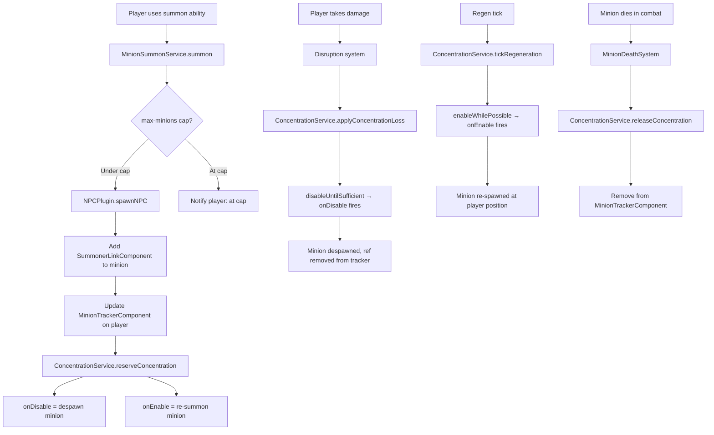

# Due Diligence: Minion/Summon Concentration System

## API Availability

### Available APIs

#### NPC Spawning
- **`NPCPlugin.get().spawnNPC(Store<EntityStore>, String npcType, String groupType, Vector3d position, Vector3f rotation)`** — Found at [NPCPlugin.java](../../../lib/hytale-server/src/main/java/com/hypixel/hytale/server/npc/NPCPlugin.java#L870). Returns `Pair<Ref<EntityStore>, INonPlayerCharacter>`. The `npcType` parameter is a role name (e.g., `"Kweebec_Sapling"`), `groupType` can be null. Internally calls `spawnEntity()` which creates a `Holder<EntityStore>`, adds `NPCEntity`, `TransformComponent`, `HeadRotation`, `DisplayNameComponent`, `UUIDComponent`, optionally `ModelComponent`, then `store.addEntity(holder, AddReason.SPAWN)`.
- **`NPCPlugin.get().spawnEntity(...)`** — Lower-level overload at line ~1100. Accepts `roleIndex`, `position`, `rotation`, optional `Model`, optional pre-add and post-spawn `TriConsumer` callbacks. The `preAddToWorld` callback runs before `store.addEntity()` (useful for injecting custom components like a summoner-link). The `postSpawn` callback runs after.
- **`NPCPlugin.get().getIndex(String roleName)`** — Returns the integer role index for an NPC type name.
- **`NPCPlugin.get().getName(int roleIndex)`** — Returns the role name string for a role index.
- **`NPCEntity`** — Component at `com.hypixel.hytale.server.npc.entities.NPCEntity`, extends `LivingEntity`, implements `INonPlayerCharacter`. Has `getRoleName()`, `getRoleIndex()`, `getInventory()`, `setInventorySize()`. Registered as an entity type with `NPCEntity.getComponentType()`.
- **`INonPlayerCharacter`** — Minimal interface at `com.hypixel.hytale.server.core.universe.world.npc.INonPlayerCharacter`. Only provides `getNPCTypeId()` and `getNPCTypeIndex()`.

#### Entity Death Detection
- **`DeathSystems.OnDeathSystem`** — Base class at `com.hypixel.hytale.server.core.modules.entity.damage.DeathSystems`. It is a `RefChangeSystem<EntityStore, DeathComponent>` that fires `onComponentAdded()` when `DeathComponent` is added to a matching entity. Override `getQuery()` to filter to specific entity types.
- **`DeathComponent`** — Component carrying death info via `getDeathInfo()` → `Damage`. Added by damage pipeline when HP ≤ 0.
- **`DeathSystems.CorpseRemoval`** — Ticking system that calls `commandBuffer.removeEntity(ref, RemoveReason.REMOVE)` on dead non-player entities after corpse timer expires.

#### Entity Removal
- **`commandBuffer.removeEntity(Ref<EntityStore> ref, RemoveReason reason)`** — Standard pattern for removing entities. Found throughout the codebase (EntityStore.java line 157, StandardPhysicsProvider.java, DeathSystems.CorpseRemoval, etc.).
- **`store.removeEntity(ref, RemoveReason)`** — Direct store removal, returns a `Holder<EntityStore>`. Used for player removal (`PlayerRef.removeFromStore()`).
- **`EntityRemoveEvent`** — Global event at `com.hypixel.hytale.server.core.event.events.entity.EntityRemoveEvent`. Extends `EntityEvent<Entity, String>`. Can be listened to via `registerGlobal()`.
- **`RefSystem.onEntityRemove()`** — Called when an entity matching the system's query is removed from the store. Useful for cleanup.

#### Player Events
- **`PlayerReadyEvent`** — Global event fired when player fully loads. Provides `getPlayerRef()` → `Ref<EntityStore>`. Already used in HyforgedPlugin line 521.
- **`PlayerDisconnectEvent`** — Global event. Provides `getPlayerRef()` → `PlayerRef`. Already used in HyforgedPlugin line 557 for HUD/combat log cleanup.

#### Concentration Service
- **`ConcentrationService.reserveConcentration(Ref, abilityId, cost, onDisable, onEnable)`** — Registers ability with Runnable callbacks.
- **`ConcentrationService.releaseConcentration(Ref, abilityId)`** — Releases ability and re-enables others if possible.
- **`ConcentrationService.applyConcentrationLoss(Ref, lossAmount)`** — Triggers disable callbacks for lowest-priority abilities.
- **`ConcentrationService.tickRegeneration(Ref, regenAmount)`** — Triggers enable callbacks as concentration recovers.
- **`ConcentrationService.getCurrentConcentration(Ref)`** — Returns current value.
- **`ConcentrationService.getMaxConcentration(Ref)`** — Returns max from stat index.

### Missing or Uncertain APIs

- **NPC Ownership / Summoner Link** — No native Hytale API for marking an NPC as "owned by" a player. Must be implemented as a custom Hyforged ECS component (e.g., `SummonerLinkComponent`).
- **NPC Template Override at Runtime** — The `spawnNPC()` API always uses a registered role/template. Dynamic stat modification after spawn must happen via `EntityStatMap.putModifier()` (available) or `HyforgedStatComponent` modifiers. No API to pass stat overrides during spawn, but `postSpawn` callback allows immediate modification.
- **Kill Attribution for Minions** — No native API for attributing minion kills to the summoner. Deferred per requirements.
- **Minion Follow/AI Override** — Minion AI behavior is defined by the NPC template JSON role. A "summoned minion" template must be created (or use leash/beacon systems). The NPC behavior system (roles, states, sensors) is entirely data-driven via JSON. A dedicated minion "follow player" behavior would require a new NPC template or role override.

## Existing Code Impact

### Files to Modify

| File | Change Required |
|------|-----------------|
| `HyforgedMinionStatBridgeSystem.java` | Convert from no-op stub to functional `RefChangeSystem` that propagates summoner stats to minions via `SummonerLinkComponent` query. |
| `HyforgedPlugin.java` | Register new components (`SummonerLinkComponent`, `MinionTrackerComponent`), new systems (`MinionSummonService`, `MinionDeathSystem`, `MinionDisconnectCleanupSystem`), add PlayerDisconnect handler for minion cleanup. |
| `ResourceStatsHudSystem.java` | Add concentration breakpoints (segmented bar showing per-ability costs) and regen rate display. Currently sends `concentrationCurrent/concentrationMax` as simple integers. |
| `HyforgedHud.java` | Add HUD update methods for concentration breakpoints/segments and regen rate text. |
| `HyforgedHud.ui` | Add UI elements for segmented concentration bar, breakpoint markers, regen rate label. |
| `ConcentrationPriorityComponent.java` | Possibly add helper method to compute breakpoint positions for HUD. |
| `ConcentrationService.java` | May need a `getAbilityCostBreakpoints(Ref)` method for HUD data. No modifications to core reserve/release logic needed. |

### Files to Create

| File | Purpose |
|------|---------|
| `SummonerLinkComponent.java` | ECS component on minion entities linking to summoner UUID + entity ref. |
| `MinionTrackerComponent.java` | ECS component on summoner (player) tracking active minion refs, types, and ability IDs. |
| `MinionSummonService.java` | Service handling spawn, despawn, re-spawn logic; integrates with ConcentrationService. |
| `MinionDeathSystem.java` | `DeathSystems.OnDeathSystem` reacting to minion death to release concentration. |
| `MinionDisconnectCleanupSystem.java` | Event handler for PlayerDisconnectEvent to despawn all minions. |
| `Server/Hyforged/Minions/*.json` | Minion type definitions (NPC template ref, concentration cost, stats). |

### Related TODOs Found

- [HyforgedMinionStatBridgeSystem.java line 34](src/main/java/reign/software/hyforged/stats/system/HyforgedMinionStatBridgeSystem.java#L34): `TODO (Phase 6+): When a minion summoning system is implemented: Change this to a RefChangeSystem reacting to a summoner-link component...`
- [HyforgedMinionStatBridgeSystem.java line 84](src/main/java/reign/software/hyforged/stats/system/HyforgedMinionStatBridgeSystem.java#L84): `TODO: Change to summoner-link component query when that component is registered.`
- [HyforgedMinionStatBridgeSystem.java line 109](src/main/java/reign/software/hyforged/stats/system/HyforgedMinionStatBridgeSystem.java#L109): `TODO: Implement minion stat propagation when summoner/minion-link system exists.`

## Integration Points

### ConcentrationService
- **How it connects:** Each minion reservation calls `ConcentrationService.reserveConcentration()` with an `onDisable` callback that despawns the minion and an `onEnable` callback that re-summons at the player's current position. The pattern already exists in `HyforgedEffectBridgeSystem` (lines 210-235) which uses `removeEffectIfActive` / `addEffectIfMissing` as callbacks. The minion system follows this exact pattern but calls spawn/despawn instead.
- **Callback Safety:** The `onDisable`/`onEnable` Runnables are executed synchronously within `ConcentrationService.disableUntilSufficient()` and `enableWhilePossible()` (lines 378-420). These are called from `applyConcentrationLoss()` (disruption system, runs on world tick thread) and `tickRegeneration()` (regen system, runs on world tick thread). Both callers are ECS system `tick()` methods, so callbacks execute on the world thread — safe for entity operations.

### Stat System
- **Minion Stats:** All 9 stats already exist in JSON definitions: `minion-damage-bps`, `minion-life-bps`, `minion-speed-bps`, `minion-accuracy-bps`, `minion-attack-speed-bps`, `minion-crit-chance-bps`, `max-minions`, `minion-duration-bps`, `minion-skill-levels`. All have correct categories ("minion"), BPS formatting, and proper tag structures.
- **`HyforgedMinionStatBridgeSystem`**: Stub with all 8 stat index caches already defined (excludes `minion-skill-levels`). Must be converted from `EntityTickingSystem` to `RefChangeSystem<EntityStore, SummonerLinkComponent>` to react when a summoner link is established on a new minion.
- **`reservation-efficiency-bps`**: Already used in `HyforgedEffectBridgeSystem.applyReservationEfficiency()`. Same logic should be applied to minion concentration costs.

### Disruption System
- **`HyforgedConcentrationDisruptionSystem`**: Complete and functional. Correctly handles: cancelled damage (skip), missed attacks via `HyforgedHitResolutionSystem.MISS` meta (skip), auto-blocked via `HyforgedAutoBlockSystem.AUTO_BLOCKED` meta (skip). Calculates loss as `(damage / maxHp) * maxConcentration`, applies reduction via `concentration-loss-reduction-bps`. Calls `ConcentrationService.applyConcentrationLoss()` which cascades to `disableUntilSufficient()` → fires `onDisable` callbacks. **No gaps found for minion integration — the system is generic.**

### Regeneration System
- **`HyforgedConcentrationRegenerationSystem`**: Complete and functional. Uses `DelayedEntitySystem` with 0.2s interval. Formula: `wisdom * scalingFactor * (1 + regenRateBps/10000)`. Calls `ConcentrationService.tickRegeneration()` which cascades to `enableWhilePossible()` → fires `onEnable` callbacks. **No gaps found.**

### Resource Stats HUD
- **`ResourceStatsHudSystem`**: Sends concentration/rage current+max as integers every 0.2s via `HyforgedHud.updateResourceStats()`. For breakpoints: need to pass an array of breakpoint positions (cumulative ability costs) and the regen rate as additional data. The `HyforgedStatComponent` already tracks dirty flags for HUD change detection.

### Combat System
- **Kill Attribution**: Deferred per requirements. When implemented later, minion damage events would need to carry summoner UUID metadata that the kill feed system can read.

### Player Disconnect
- **Existing handler** at HyforgedPlugin line 557 cleans up HUD, combat log, currency, progression, options. Must add minion despawn cleanup: iterate player's `MinionTrackerComponent`, remove all minion entities, release all concentration reservations.

## Dependencies

- No external library dependencies. All APIs are from the Hytale server SDK.
- **Plugin dependency**: NPCPlugin must be loaded before Hyforged (it's a core Hytale plugin, always available).
- **`manifest.json`**: No changes needed; NPCPlugin is part of Hytale's default server stack, not a third-party dependency.

## Data Architecture

### New Components

| Component | Purpose | Key Fields |
|-----------|---------|------------|
| `SummonerLinkComponent` | Attached to minion entities. Links minion to summoner. | `UUID summonerUuid`, `String minionTypeId`, `String concentrationAbilityId`, `long summonTimestamp` |
| `MinionTrackerComponent` | Attached to summoner (player) entities. Tracks all active minions. | `Map<String, List<Ref<EntityStore>>> activeMinions` (keyed by minion type), `int totalMinionCount` |

### New JSON Definitions

| Path | Purpose |
|------|---------|
| `Server/Hyforged/Minions/<MinionTypeId>.json` | Minion type definition. Fields: `npcTemplate` (role name), `concentrationCost` (flat int), `defaultPriority` (int), `baseDuration` (optional, seconds, 0=permanent), `statBridgeMappings` (which summoner stats map to which minion stats) |

### Serialization

- `SummonerLinkComponent`: Needs `BuilderCodec` with `summonerUuid` (UUID codec), `minionTypeId` (String), `concentrationAbilityId` (String). The `Ref<EntityStore>` for the summoner is transient (resolved at runtime, not persisted). Minions should NOT persist across server restarts — they are transient entities tied to concentration reservations.
- `MinionTrackerComponent`: Transient only — no persistence needed. Rebuilt from `ConcentrationPriorityComponent`'s persisted ability list on player login. This avoids serializing entity refs.
- Minion JSON definitions: Standard `BuilderCodec` loaded via `AssetRegistry` or custom registry.

### Data Flow



## Risk Assessment

### High Risk

| Risk | Impact | Mitigation |
|------|--------|------------|
| **Ref capture in callbacks** — `onDisable`/`onEnable` Runnables in `ConcentratedAbility` capture `Ref<EntityStore>` for the minion entity. If the minion is removed between capture and callback execution, the Ref becomes invalid. | Could cause NPE or zombie entity references. | Always check `ref.isValid()` at the start of every callback. The `HyforgedEffectBridgeSystem` already does this pattern (`removeEffectIfActive` line 278: `if (!entityRef.isValid()) return`). Apply the same guard. |
| **Summoner Ref in minion callbacks** — The `onEnable` callback needs the summoner's `Ref<EntityStore>` to read position for re-summon. If the summoner disconnects, this ref is invalid. | Could attempt to spawn a minion for a disconnected player. | Store summoner UUID in `SummonerLinkComponent`. Resolve ref at callback time from `EntityStore.entitiesByUuid`. If not found, no-op. |
| **Callback thread context** — `disableUntilSufficient()` and `enableWhilePossible()` run callbacks synchronously within the iterating system. If a callback triggers `NPCPlugin.spawnNPC()` which calls `store.addEntity()`, this may cause concurrent modification on the store. | Could crash or corrupt entity store. | Use `world.execute(() -> { ... })` or `commandBuffer.run()` to defer spawn/despawn to end of tick. Alternatively, queue spawn/despawn requests and process them in a dedicated `TickingSystem`. The `SpawnNPCInteraction` uses `commandBuffer.run(store -> this.spawnNPC(...))` as a safe pattern. |

### Medium Risk

| Risk | Impact | Mitigation |
|------|--------|------------|
| **NPC template availability** — Minion NPC templates must exist and be valid roles. Invalid role names cause `spawnNPC()` to return null. | Minion fails to spawn silently. | Validate minion type JSON at load time. Log warnings for invalid templates. Add null checks on spawn result. |
| **Concentration breakpoint HUD complexity** — Segmented bar visualization requires calculating per-ability costs and sending an array to the client. Current HUD only sends two integers. | UI rework needed; could delay feature. | Phase the HUD enhancement: Phase 1 ships with current simple bar + regen rate text. Phase 2 adds segmented breakpoints. |
| **Persistence edge cases** — Player logs out with minions active. On reconnect, `ConcentrationPriorityComponent` restores ability entries from persistence, but `onDisable`/`onEnable` Runnables are `null` (not serialized). Minions don't exist. | Orphaned concentration reservations without functional callbacks. | On player ready, scan `ConcentrationPriorityComponent` for minion ability IDs (by prefix convention e.g., `"minion:"`). For each, re-register callbacks via `MinionSummonService`. If concentration is sufficient, trigger `onEnable` to spawn. If not, leave disabled. |
| **Minion count tracking accuracy** — If a minion dies and the `MinionDeathSystem` doesn't fire (e.g., entity removed without `DeathComponent`), the tracker could have stale entries. | Could prevent new summons or leak concentration. | Use both `DeathSystems.OnDeathSystem` AND `RefSystem.onEntityRemove()` for cleanup. The `onEntityRemove` catches all removal reasons. |

### Low Risk

| Risk | Mitigation |
|------|------------|
| **Performance: many minions** — Each minion is a full NPC entity with AI, pathfinding, etc. | Cap via `max-minions` stat (already defined). Start with conservative defaults (e.g., max 5). |
| **Minion AI complexity** — Summoned minions need follow-player behavior. | Leverage existing NPC template system: create a `Template_SummonedMinion` with leash-to-summoner behavior. |
| **Stat bridge re-computation** — When summoner stats change, minion stats need updating. | `HyforgedMinionStatBridgeSystem` as `RefChangeSystem` reacts to `SummonerLinkComponent` add. For ongoing updates, consider a periodic `DelayedEntitySystem` that re-syncs stats every few seconds. |

## Unknowns & Blockers

1. **NPC follow-player AI template** — No existing NPC template for "follow this player" behavior exists in the vanilla Hytale assets. A custom template must be authored. The NPC behavior system supports leash/chase mechanics, but wiring a minion to follow a specific player entity requires understanding `BuilderSensorEntity` and target-setting actions. This needs experimentation with the NPC template JSON system.

2. **`store.addEntity()` safety from within callbacks** — The `enableWhilePossible()` method iterates through abilities and calls `onEnable.run()` synchronously. If that callback calls `NPCPlugin.spawnNPC()` → `store.addEntity()`, this could cause problems if the store is mid-iteration. The `SpawnNPCInteraction` wraps spawning in `commandBuffer.run()` — this pattern should be replicated, but needs testing to confirm it works from within a `ConcentrationService` callback chain.

3. **`commandBuffer.removeEntity()` from within a callback** — Similar to above. When `onDisable` fires, calling `commandBuffer.removeEntity()` should be safe since `CommandBuffer` queues operations. But the callback doesn't receive a `CommandBuffer` parameter — only the `Runnable` closure has access. The world's `Store` must be obtained from `Ref.getStore()` and removal performed via `store` or deferred. Need to verify the exact removal pattern.

4. **Minion entity persistence** — Should minions survive server restarts? If yes, `SummonerLinkComponent` needs persistence and a load-time reconciliation system. If no (recommended), minions are transient and restored from concentration state on login.

5. **Multiple minions of the same type** — The `ConcentrationService` uses `abilityId` as a unique key per entity. Multiple minions of the same type need unique ability IDs (e.g., `"minion:skeleton:1"`, `"minion:skeleton:2"`). This needs a naming convention.

## Recommendations

### High-Level Technical Approach

1. **New `SummonerLinkComponent`** on minion entities. Contains summoner UUID, minion type ID, concentration ability ID. Registered in `HyforgedPlugin.setup()`.

2. **New `MinionTrackerComponent`** on player entities. Tracks active minion refs and types. Transient (not persisted). Registered in `HyforgedPlugin.setup()`.

3. **`MinionSummonService`** (singleton service, like `ConcentrationService`):
   - `summon(Ref<EntityStore> summoner, String minionTypeId)` — Validates cap, applies reservation-efficiency, spawns NPC via `NPCPlugin.spawnNPC()` using `preAddToWorld` callback to inject `SummonerLinkComponent`, registers concentration with despawn/re-spawn callbacks.
   - `despawnMinion(Ref<EntityStore> minionRef)` — Removes minion entity via deferred `commandBuffer.removeEntity()`.
   - `respawnMinion(UUID summonerUuid, String minionTypeId, String abilityId)` — Resolves summoner ref, spawns at their position, links to existing concentration reservation.
   - `cleanupForPlayer(UUID playerUuid)` — Called on disconnect. Despawns all minions, releases all minion concentration reservations.

4. **Convert `HyforgedMinionStatBridgeSystem`** from `EntityTickingSystem` (no-op stub) to `RefChangeSystem<EntityStore, SummonerLinkComponent>`. On `onComponentAdded`, read the summoner's `HyforgedStatComponent`, apply BPS modifiers to the minion's `EntityStatMap`. Consider a companion `DelayedEntitySystem` for periodic stat re-sync.

5. **New `MinionDeathSystem`** extending `DeathSystems.OnDeathSystem`. Query: `Query.and(SummonerLinkComponent, DeathComponent)`. On death: call `ConcentrationService.releaseConcentration()` for the minion's ability ID, remove from `MinionTrackerComponent` on the summoner.

6. **Minion JSON Definitions** — Data-driven minion type definitions under `Server/Hyforged/Minions/`. Each file specifies NPC template, concentration cost, default priority, optional duration.

7. **Use `commandBuffer.run()` for spawning/despawning inside callbacks** — The `onDisable`/`onEnable` Runnables should not call `store.addEntity()` or `store.removeEntity()` directly. Instead, queue the operation via `store.getExternalData().getWorld().execute(() -> ...)` or capture a `CommandBuffer` reference. The safest pattern is to have the callbacks set a flag on `MinionTrackerComponent` and have a `TickingSystem` process the queue.

### Phasing Suggestions

- **Phase 1: Core Summoning** — `SummonerLinkComponent`, `MinionTrackerComponent`, `MinionSummonService`, basic spawn/despawn with concentration integration, `MinionDeathSystem`. Simple minion NPC template (stationary or basic follow).
- **Phase 2: Stat Bridge** — Convert `HyforgedMinionStatBridgeSystem` to functional system. Summoner stats propagate to minion stats. Add periodic re-sync.
- **Phase 3: HUD Enhancement** — Concentration breakpoints on the bar, regen rate display, minion count indicator.
- **Phase 4: Minion AI** — Custom NPC templates for follow-player, attack-nearby-enemies, return-to-summoner behaviors.
- **Phase 5: Persistence & Reconnect** — Minion state restoration on login from `ConcentrationPriorityComponent` data.

### Callback Safety Pattern (Recommended)

Rather than spawning/despawning directly in `Runnable` callbacks, use a request queue:

```
ConcentratedAbility.onDisable → MinionSummonService.enqueueDespawn(minionRef)
ConcentratedAbility.onEnable  → MinionSummonService.enqueueRespawn(summonerUuid, minionTypeId, abilityId)

MinionSummonTickingSystem (TickingSystem, runs each tick):
  → process despawn queue: commandBuffer.removeEntity(ref, RemoveReason.REMOVE)
  → process spawn queue: NPCPlugin.get().spawnNPC(...)
```

This avoids any concurrent modification risks from spawning inside the concentration iteration loop.

## Questions for User

1. **Minion persistence across server restarts?** Should minions survive a server restart and be restored when the server boots, or should they be transient (despawned on shutdown, re-summoned by player action after login)? Recommendation: transient — simpler and avoids orphan minions.

2. **Minion AI behavior priority?** Is a basic "follow player, attack nearby enemies" template sufficient for Phase 1, or do different minion types need distinct AI behaviors from the start?

3. **Multiple minions of the same type?** Can a player summon multiple copies of the same minion type (e.g., 3 skeletons), or is each minion type limited to one instance? This affects the concentration ability ID naming convention.

4. **Minion duration vs permanent?** The `minion-duration-bps` stat exists. Should minions have a base duration (expiring naturally) or be permanent (only removed by death, concentration loss, or player action)? Can both modes coexist per minion type definition?

5. **Minion re-summon position?** When concentration regenerates and `onEnable` fires, should the minion always re-summon at the player's current position, or at the location where it was last alive?

6. **HUD breakpoint priority?** Is the concentration bar segmentation (showing per-ability cost breakpoints) a launch requirement, or can it be deferred to a later phase? The current simple bar is already functional.
