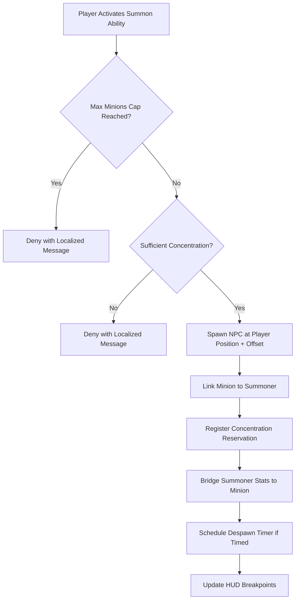
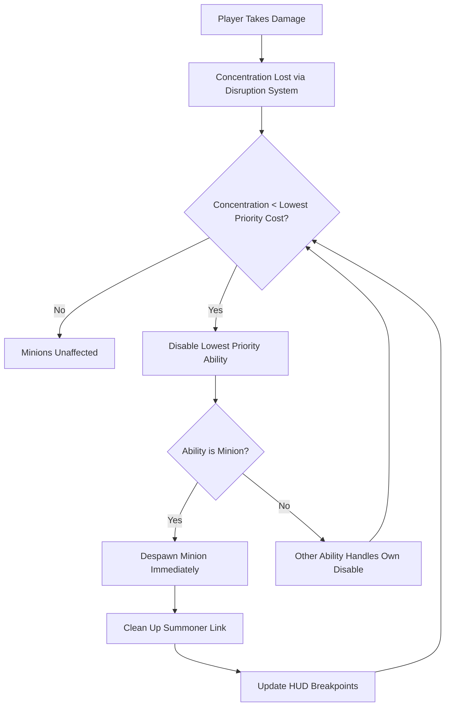
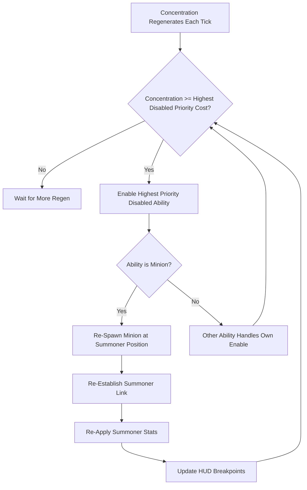
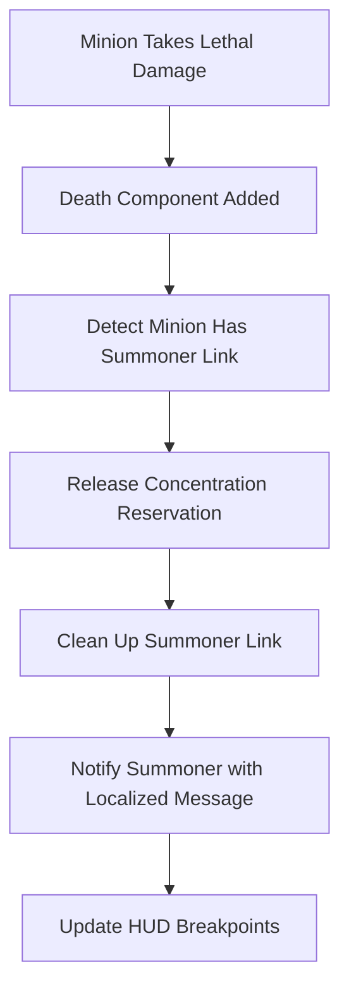
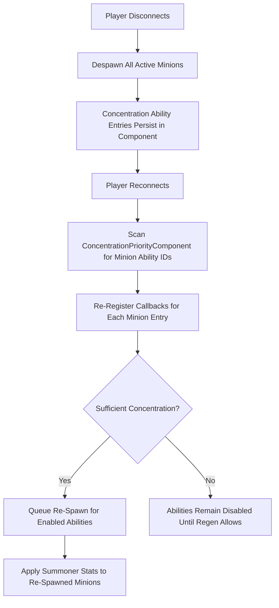

# Feature Spec: Minion/Summon Concentration System

## Metadata
- Feature ID (slug): minion-concentration-system
- Status: Draft
- Owner: JBurl
- Date: 2026-02-19

## Summary
A data-driven minion summoning system where players summon NPC-based minions that persist as long as concentration is reserved. Minion summons integrate with the existing concentration priority queue, disruption, regeneration, and stat systems. Summoner stats bridge to active minions, and the resource stats HUD is enhanced with segmented concentration breakpoints and regen rate display.

## Goals
- Allow players to summon NPC-based minions that persist as long as concentration is reserved for them
- Integrate minion summoning into the existing concentration priority queue (disable/enable callbacks, priority ordering)
- Wire the 9 existing minion stat definitions from summoner to active minions via the stat bridge system
- Provide a data-driven minion definition format (JSON) under `Server/Hyforged/Minions/`
- Enhance the resource stats HUD to display concentration breakpoints (segmented bar) and effective regen rate
- Enforce `hyforged:max-minions` stat cap at spawn time and reactively when the cap decreases

## Non-Goals
- Minion AI or behavior trees (leverage existing Hytale NPC templates)
- Specific summoning abilities, skills, or items that invoke the system (consumers define these separately)
- Totem, trap, or brand concentration mechanics
- Minion-to-minion interactions or formations
- Client-side prediction of spawn/despawn
- `minion-skill-levels` stat bridging (deferred until a skill level system exists)
- Kill attribution or loot/XP sharing from minion kills (future feature)
- Minion equipment or inventory management

## User Experience

### Summoning a Minion
A player activates a summoning ability (item, skill, or command). The system validates concentration availability and minion cap, then spawns the minion near the player. The concentration bar updates to show the new reservation as a visual segment.

### Concentration Disruption Disables Minion
When a player takes damage and loses concentration below a minion's cost threshold, the concentration priority queue disables the minion's reservation. The minion despawns immediately.

### Concentration Regeneration Re-Enables Minion
As concentration regenerates (Wisdom-based), the priority queue re-enables previously disabled abilities. When a minion ability is re-enabled, the minion re-spawns at the summoner's current position.

### Minion Dies in Combat
When a minion is killed by combat damage (not concentration loss), the concentration reservation is fully released, freeing the cost. The summoner is notified.

### Disconnect and Reconnect
On disconnect, all minions despawn. On reconnect, concentration ability entries persist. If sufficient concentration is available, minions auto re-summon.

### HUD Visualization
- The concentration bar displays segmented breakpoints, one per concentrated ability, ordered by priority (highest first)
- Disabled segments appear visually dimmed or empty
- Effective concentration regen rate (per second) is displayed near the bar
- Segments update dynamically on add/remove/reorder/disable/enable

### Voluntary Release
A player can manually unsummon a minion via UI or command. This fully removes the reservation from the concentration queue.

## Functional Requirements

### FR-1: Summoner-Minion Link Component
- A new ECS component attached to minion entities that links them to their summoner
- Fields: summoner UUID, minion type ID, concentration ability ID, summon timestamp
- When either entity is removed, the link is cleaned up and resources released

### FR-2: Minion Definition Data Format
- JSON definitions stored under `Server/Hyforged/Minions/`
- Each definition specifies: NPC template reference, concentration cost, default priority, base duration (0 = permanent), spawn offset, tags, and stat overrides
- A registry provides runtime lookup of definitions by namespaced ID
- Definitions are validated at server load time (including NPC template availability)

### FR-3: Minion Spawning Service
- Provides an API for spawning minions: accepts a summoner reference and minion type ID
- Validates the `hyforged:max-minions` cap before spawning
- Validates available concentration is sufficient for the minion's cost
- Spawns the NPC via the existing NPC spawning API with a pre-add callback to attach the summoner link component
- Registers the concentration reservation via ConcentrationService with despawn (onDisable) and re-spawn (onEnable) callbacks
- Applies the summoner's minion stats via the stat bridge
- Schedules a despawn timer if the minion definition specifies a duration > 0 (modified by `minion-duration-bps`)
- Uses a request queue processed by a ticking system to avoid spawning entities from within callback iteration

### FR-4: Minion Unsummoning (Concentration Disable Callback)
- When the concentration system fires an onDisable callback for a minion ability, the minion is despawned immediately (same tick)
- The summoner link is cleaned up
- The concentration reservation stays registered but disabled (allowing re-enable via regen)

### FR-5: Minion Re-Summoning (Concentration Enable Callback)
- When the concentration system fires an onEnable callback for a minion ability, the minion re-spawns at the summoner's current position
- The summoner link is re-established and summoner stats re-applied
- Processed via the spawn request queue (not directly in the callback)

### FR-6: Minion Stat Bridging
- The existing `HyforgedMinionStatBridgeSystem` is converted from a stub to a functional system
- When a summoner link component is added to a minion, the summoner's stats are read and applied to the minion:
  - `hyforged:minion-damage-bps` — outgoing damage multiplier
  - `hyforged:minion-life-bps` — max health multiplier
  - `hyforged:minion-speed-bps` — movement speed multiplier
  - `hyforged:minion-accuracy-bps` — accuracy rating
  - `hyforged:minion-attack-speed-bps` — attack speed
  - `hyforged:minion-crit-chance-bps` — crit chance
  - `hyforged:minion-duration-bps` — despawn timer multiplier (applied to spawn service timers, not directly to minion)
  - `hyforged:max-minions` — cap enforcement only (not applied to minion)

### FR-7: Max Minions Cap Enforcement
- Before spawning: count active summoner-linked minions; if count >= cap, deny with a localized message
- If `max-minions` decreases while minions are active (e.g., equipment change): unsummon the lowest-priority minion(s) until count <= new cap

### FR-8: Voluntary Minion Release
- A player can manually unsummon a specific minion via UI or command
- This calls ConcentrationService.releaseConcentration, fully removing the entry from the priority queue
- The minion is despawned and the link cleaned up

### FR-9: Concentration HUD Breakpoints
- The resource stats HUD displays segmented markers on the concentration bar for each concentrated ability
- Segments are ordered by priority (highest first)
- Disabled segments appear visually distinct (dimmed/empty styling)
- Segments update dynamically when abilities are added, removed, reordered, disabled, or enabled

### FR-10: Concentration HUD Regen Rate Display
- The effective concentration regen rate (per second) is displayed near the concentration bar
- Reflects the Wisdom-based computation plus the `hyforged:concentration-regen-rate-bps` modifier

### FR-11: Minion Death Handling
- When a minion dies from combat damage (not from concentration loss), the concentration reservation is fully released (frees the cost)
- The summoner link is cleaned up
- The summoner receives a localized notification
- This is distinct from FR-4 forced unsummon (which keeps the reservation registered but disabled)

### FR-12: Minion Persistence Across Sessions
- On disconnect: all summoner-linked minions are despawned
- Concentration ability entries persist in the ConcentrationPriorityComponent (serialized with player data)
- On reconnect: scan the component for minion-prefixed ability IDs, re-register spawn/despawn callbacks
- If sufficient concentration is available: auto re-summon enabled minion abilities
- If insufficient: abilities remain disabled until concentration regeneration allows re-enable

## Non-Functional Requirements

### NFR-1: Performance
- Latency is the #1 priority. Single-tick spawn and despawn operations
- Stat indices cached lazily on first use (already prepared in the stub system)
- O(1) minion count via a tracker component on the summoner
- HUD updates are change-detected (only send updates when concentration state changes)

### NFR-2: Data-Driven
- All minion types defined in JSON. No hard-coded minion type IDs, costs, or behaviors
- Concentration costs, priorities, durations, and stat overrides sourced from JSON definitions
- NPC templates referenced by ID (Hytale's data-driven NPC template system)

### NFR-3: Localization
- All player-facing text uses `Message.translation(...)` with keys in language resource files
- Messages include: cap reached, insufficient concentration, minion summoned, minion died, minion despawned, minion re-summoned

### NFR-4: ECS Compliance
- All new components implement `Component<EntityStore>` with default constructor and clone
- Entity mutations go through CommandBuffer
- Systems registered via `EntityStoreRegistry` in plugin setup
- Composition over inheritance; no entity subclasses

### NFR-5: Observability
- Log spawn/despawn events at FINE level
- Log cap enforcement decisions at INFO level
- Log errors (missing definitions, invalid refs) at WARNING or higher

## Dependencies

### Required
- **ConcentrationService** — Existing service for reserve/release/priority management. No modifications to core API needed; a helper for breakpoint computation may be added
- **ConcentrationPriorityComponent** — Existing component for storing ability priority queue per entity (persisted)
- **Concentration Disruption System** — Existing system that triggers onDisable/onEnable callbacks
- **Concentration Regeneration System** — Existing system that regenerates concentration and triggers re-enable
- **Hyforged Stats System** — 9 minion stat definitions already exist in JSON and are registered
- **HyforgedMinionStatBridgeSystem** — Existing stub to be converted to functional
- **NPCPlugin** — Hytale API for spawning NPCs with pre-add callbacks
- **DeathSystems.OnDeathSystem** — Hytale API for detecting entity death
- **Resource Stats HUD** — Existing HUD system to be extended with breakpoints and regen display

### Optional Integrations
- **Combat Log** — Minion damage events could appear in the combat log (future)
- **Kill Attribution** — Deferred; minion kills currently do not credit the summoner

## Data/Schema Impact

### New Components
- **SummonerLinkComponent** — On minion entities. Fields: summoner UUID, minion type ID, concentration ability ID, summon timestamp
- **MinionTrackerComponent** — On summoner entities (transient, not persisted). Tracks active minion refs and count for O(1) access

### New JSON Definitions
- `Server/Hyforged/Minions/<MinionType>.json` — One file per minion type defining NPC template, concentration cost, default priority, base duration, spawn offset, tags, and stat overrides

### Changes to Existing Data
- ConcentrationPriorityComponent already persists ability entries; minion entries use a `minion:<typeId>:<index>` naming convention for ability IDs to support multiple copies of the same type

## API Changes

### New Service
- **MinionSummonService**
  - `summon(summonerRef, minionTypeId)` — Spawn a minion, returns success/failure
  - `unsummon(summonerRef, minionTypeId, index)` — Voluntarily release a specific minion
  - `unsummonAll(summonerRef)` — Release all minions for a summoner
  - `getActiveMinions(summonerRef)` — List of active minion info
  - `getMinionCount(summonerRef)` — Current active count

### New Registry
- **MinionDefinitionRegistry**
  - `get(minionTypeId)` — Lookup a minion definition by namespaced ID
  - `getAll()` — All registered definitions

### Existing API Additions
- **ConcentrationService** — Add `getAbilityCostBreakpoints(entityRef)` helper for HUD segmentation data
- **ConcentrationPriorityComponent** — Add breakpoint computation helper for efficient HUD rendering

### New Events (optional)
- Minion-specific events may be exposed for other systems to react to (e.g., MinionSpawnedEvent, MinionDiedEvent)

## Security/Privacy
N/A — All computation is server-authoritative. No player data is exposed beyond what is already visible in the HUD. Minion state is transient (not stored externally).

## Observability
- **FINE**: Minion spawn/despawn events (minion type, summoner UUID, position)
- **FINE**: Stat bridge application (which stats applied, values)
- **INFO**: Cap enforcement (minion denied, cap value, current count)
- **INFO**: Reconnect re-summon results (how many re-summoned, how many remain disabled)
- **WARNING**: Missing minion definition at spawn time
- **WARNING**: Invalid entity ref in callbacks (ref safety guards triggered)
- **SEVERE**: Unexpected exceptions during spawn queue processing

## Risks

### HIGH: Ref Capture Safety in Callbacks
Concentration disable/enable callbacks capture entity refs that may become invalid between registration and invocation. **Mitigation**: All callbacks guard with `ref.isValid()` checks before any operation.

### HIGH: Entity Spawn from Within Callback Iteration
Spawning entities directly inside a concentration callback could corrupt archetype iteration. **Mitigation**: Use a request queue (spawn/despawn requests) processed by a dedicated ticking system, not directly in callbacks.

### MEDIUM: Persistence Edge Cases on Reconnect
Player reconnects with concentration ability entries but the concentration state may have changed. **Mitigation**: On reconnect, scan ConcentrationPriorityComponent for minion-prefixed ability IDs, re-register callbacks, and reconcile enabled states against current concentration.

### MEDIUM: NPC Template Availability
Minion definitions reference NPC templates that must exist. **Mitigation**: Validate all minion definitions at server load time; log warnings for invalid template references and skip registration.

### LOW: HUD Update Frequency
Frequent concentration changes (combat with many hits) could cause excessive HUD updates. **Mitigation**: Change-detect and throttle HUD breakpoint updates to the existing DelayedEntitySystem tick interval.

### LOW: Multiple Same-Type Minion Uniqueness
Multiple copies of the same minion type need unique concentration ability IDs. **Mitigation**: Use `minion:<typeId>:<index>` convention; index increments per summoner per type.

## Open Questions
- What is the maximum practical number of simultaneous minions to test against for performance? (Suggested: 20+ for stress testing)
- Should minion stat bridge updates propagate if the summoner's stats change while minions are active, or only on spawn? (Suggested: on spawn only for v1; reactive update is a future enhancement)
- Should voluntary unsummon have a cooldown to prevent abuse? (Suggested: no cooldown for v1)

## Acceptance Criteria
- [ ] SummonerLinkComponent is registered and attached to spawned minions with correct fields (FR-1)
- [ ] Minion definitions load from `Server/Hyforged/Minions/*.json` and are queryable by ID at runtime (FR-2)
- [ ] `MinionSummonService.summon()` spawns an NPC, registers concentration, and bridges stats in a single flow (FR-3)
- [ ] Minions despawn immediately when their concentration ability is disabled (FR-4)
- [ ] Minions re-spawn at the summoner's current position when their concentration ability is re-enabled (FR-5)
- [ ] All 8 bridgeable minion stats are read from the summoner and applied to the minion on spawn (FR-6)
- [ ] Spawning is denied with a localized message when `max-minions` cap is reached (FR-7)
- [ ] If `max-minions` decreases, lowest-priority minions are unsummoned until count is within cap (FR-7)
- [ ] Voluntary unsummon fully releases the concentration reservation (FR-8)
- [ ] Concentration bar displays segmented breakpoints per concentrated ability, ordered by priority (FR-9)
- [ ] Disabled breakpoint segments are visually distinct from enabled segments (FR-9)
- [ ] Effective concentration regen rate is displayed on the HUD (FR-10)
- [ ] Minion combat death releases the concentration reservation and notifies the summoner (FR-11)
- [ ] On disconnect, all minions despawn; on reconnect, eligible minions auto re-summon (FR-12)
- [ ] All player-facing messages use translation keys (NFR-3)
- [ ] No hard-coded minion types, costs, or behaviors exist in Java code (NFR-2)
- [ ] Spawn/despawn occurs within a single tick (NFR-1)
- [ ] No compilation warnings or errors introduced (project standard)

## Impacted Areas (High-Level)
- `reign.software.hyforged.concentration` — ConcentrationService (breakpoint helpers), ConcentrationPriorityComponent (breakpoint computation)
- `reign.software.hyforged.stats.system` — HyforgedMinionStatBridgeSystem (stub to functional conversion)
- `reign.software.hyforged.stats.hud` — ResourceStatsHudSystem (breakpoint segments, regen rate display)
- `reign.software.hyforged.hud` — HyforgedHud / HyforgedHud.ui (new HUD elements for breakpoints and regen)
- `reign.software.hyforged` — HyforgedPlugin (registration of new components and systems)
- `Server/Hyforged/Minions/` — New JSON definition directory
- `Server/Languages/` — New translation keys for minion messages

## Required Codebase/Architecture Changes (High-Level)

### New Subsystem
- A minion summoning subsystem with its own service, components, systems, and data definitions
- Spawn/despawn request queue processed by a ticking system (not inline in callbacks)

### New Components
- Summoner-to-minion link component on minion entities
- Active minion tracker component on summoner entities (transient)

### New Systems
- Minion death detection system (reacts to death component on entities with summoner link)
- Minion disconnect cleanup (despawn on player disconnect)
- Minion reconnect re-summon (process minion ability entries on player ready)
- Spawn queue processing ticking system

### Modified Systems
- Stat bridge system converted from stub to reactive system triggered by summoner link component
- Resource stats HUD system extended with breakpoint and regen display logic

### New Data
- Minion definition JSON schema and registry
- Example minion definitions for testing

### HUD Changes
- Concentration bar gains segmented breakpoint rendering
- Regen rate label added near concentration bar

### Plugin Registration
- All new components registered with EntityStoreRegistry
- All new systems registered in plugin setup with appropriate system groups and dependencies

## References
- [concentration-disruption.spec.md](../concentration-disruption/concentration-disruption.spec.md) — Concentration disruption, regeneration, and priority queue system
- [resource-stats-ui.spec.md](../resource-stats-ui/resource-stats-ui.spec.md) — Concentration bar HUD display
- [hyforged-stats-system.spec.md](../hyforged-stats-system/hyforged-stats-system.spec.md) — Stats framework and minion stat definitions
- ADR-0001: Hybrid Hyforged + Hytale Stats (superseded by ADR-0010)
- ADR-0006: Replace Hytale Stat/Damage Systems for Exclusive Hyforged Control
- ADR-0012: Concentration Priority UI Reordering Controls
- Existing stub: `HyforgedMinionStatBridgeSystem.java` — Documents the planned stat bridge wiring
- Existing stat definitions: `Server/Hyforged/Stats/Definitions/Minion*.json`, `MaxMinions.json`
