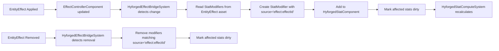

# Feature Plan: Stat System Extensions

## Metadata
- Feature ID (slug): stat-system-extensions
- Status: Done
- Owner: JBurl
- Date: 2026-01-20
- Last Updated: 2026-01-20

## Summary
Extensions to the Hyforged Stats System required for Combat System integration:
1. Soft/Hard Cap System for combat stats
2. EntityEffect → Hyforged Stats Bridge (Hybrid approach)
3. Effect Duration Scaling via `EffectDuration` stat

## ACID Plan Integrity
- Atomicity: Each phase is independently completable and ends in a buildable state.
- Consistency: Every step maps back to combat-system.spec.md Appendix A findings.
- Isolation: Phases can be developed independently; Phase 2 depends on Phase 1 for cap stats.
- Durability: Plan and status changes are recorded in the memory bank.

## Architecture Note (ECS)
- Components are pure data, Systems contain logic
- `HyforgedStatComponent` holds modifiers and cached values
- `EffectControllerComponent` is Hytale's native effect tracking component
- New `HyforgedEffectBridgeSystem` will observe effect changes and mirror to Hyforged stats

---

## Phase 1: Soft/Hard Cap System
- Phase Status: [ ] Not Started  [ ] In Progress  [x] Done

### Objective
Extend `StatDefinition` with soft/hard cap metadata and update `StackingEngine` to respect dynamic caps.

### Spec Mapping
- Combat System Spec: Appendix A, Gap 2 (Soft/Hard Cap System)
- Stats requiring caps: crit chance, block chance, evasion chance, resistances

### Steps
- [x] **1.1** Extend `StatDefinition` record with new fields:
  - `softCapBps` (int): Default cap in basis points (e.g., 5000 = 50%)
  - `hardCapBps` (int): Absolute maximum cap (e.g., 9500 = 95%)
  - `softCapBonusStat` (StatId, nullable): Optional stat that raises soft cap
- [x] **1.2** Update `StatDefinition.Builder` with new builder methods
- [x] **1.3** Update `StatDefinitionAsset` JSON codec to support new fields:
  ```json
  {
    "SoftCapBps": 5000,
    "HardCapBps": 9500,
    "SoftCapBonusStat": "hyforged:max-crit-chance"
  }
  ```
- [x] **1.4** Update `StackingEngine.compute()` to apply soft/hard caps:
  1. After normal computation (FLAT → INCREASED → MORE → CAP)
  2. If stat has `softCapBps` defined:
     a. Calculate effective soft cap = softCapBps + bonusStatValue (if bonusStat exists)
     b. Clamp effective soft cap to hardCapBps
     c. Clamp computed value to effective soft cap
- [x] **1.5** Update `StackingEngine.computeWithBreakdown()` to include cap info in result
- [ ] **1.6** Define combat stats with caps in JSON assets:
  - `crit-chance-bps`: soft 5000, hard 9500, bonus `max-crit-chance-bps`
  - `block-chance-bps`: soft 7500, hard 9000, bonus `max-block-chance-bps`
  - `evasion-chance-bps`: soft 5000, hard 7500, bonus `max-evasion-chance-bps`
  - `fire-resistance-bps`: soft 7500, hard 9000, bonus `max-fire-resistance-bps`
  - (similar for cold, lightning, chaos resistances)
- [x] **1.7** Create unit tests for soft/hard cap scenarios:
  - Value below soft cap → unchanged
  - Value at soft cap → unchanged
  - Value above soft cap, no bonus → clamped to soft cap
  - Value above soft cap, with bonus → clamped to (soft + bonus)
  - Value above hard cap → clamped to hard cap regardless of bonus

### Exit Criteria
- [x] Build passes
- [x] All soft/hard cap unit tests pass (18 tests in StackingEngineCapTest)
- [ ] Combat stats defined with cap metadata in JSON (deferred to combat system implementation)

---

## Phase 2: EntityEffect Bridge System
- Phase Status: [ ] Not Started  [ ] In Progress  [x] Done

### Objective
Create a bridge that mirrors Hytale EntityEffect stat modifiers into the Hyforged stat system, enabling tag-based modifiers on effects.

### Spec Mapping
- Combat System Spec: Appendix A, Gap 1 (EntityEffect Bridge)
- Option C: Hybrid approach (use Hytale effects for visuals, bridge stats to Hyforged)

### Architecture



### Steps
- [x] **2.1** Add `ModifierSource.EFFECT` to `ModifierSource` enum (already exists)
- [x] **2.2** Create `HyforgedEffectBridgeSystem` extending `EntityTickingSystem<EntityStore>`:
  - Query: entities with `EffectControllerComponent`, `HyforgedStatComponent`, and `EffectBridgeComponent`
  - Dependency: runs BEFORE `HyforgedStatComputeSystem`
- [x] **2.3** Implement effect tracking in `HyforgedEffectBridgeSystem`:
  - Track previously seen active effect indices per entity in `EffectBridgeComponent`
  - On tick, compare current effects to bridged set
  - Detect added effects (in current, not in bridged)
  - Detect removed effects (in bridged, not in current)
- [x] **2.4** Implement `applyEffectModifiers()`:
  - Read `EntityEffect` asset by index
  - Extract `entityStats` (Int2FloatMap) and `valueType`
  - For each stat modifier in effect:
    - Create `StatModifier` with source `"effect:{effectId}"`
    - Use `ModifierSource.EFFECT`
    - Set permanent (removed when effect ends)
  - Add to `HyforgedStatComponent`
  - Mark all stats dirty
- [x] **2.5** Implement `removeEffectModifiers()`:
  - Remove all modifiers matching source `"effect:{effectId}"`
  - Mark all stats dirty
- [x] **2.6** Handle effect duration changes (EXTEND overlap behavior):
  - No action needed for modifiers (they're permanent while effect active)
- [x] **2.7** Create `EffectBridgeComponent` (pure data) to track:
  - `bridgedEffectIndices` (IntOpenHashSet)
  - Registered during entity init if entity has EffectControllerComponent
- [x] **2.8** Create unit tests for effect bridge:
  - EffectBridgeComponent tracking tests (17 tests)
  - Source ID pattern tests
  - Full integration testing requires game runtime

### Exit Criteria
- [x] Build passes
- [x] Effect bridge unit tests pass (17 tests in EffectBridgeSystemTest)
- [ ] Effects apply modifiers to Hyforged stats (requires game runtime testing)

---

## Phase 3: Effect Duration Scaling
- Phase Status: [ ] Not Started  [ ] In Progress  [x] Done

### Objective
Scale effect durations based on the `EffectDuration` stat before application.

### Spec Mapping
- Combat System Spec: Appendix A, Gap 3 (Duration Scaling)

### Steps
- [ ] **3.1** Define `effect-duration-bps` stat in JSON (deferred to combat system)
- [x] **3.2** Create `HyforgedEffectService` utility class:
  - `calculateScaledDuration(statComponent, baseDuration)` → scaled duration
  - Reads `effect-duration-bps` from `HyforgedStatComponent`
  - Calculates: `scaledDuration = baseDuration * (10000 + effectDurationBps) / 10000`
  - Note: Effect application methods removed due to complex Hytale API requirements;
    callers should use `calculateScaledDuration()` then call Hytale API directly
- [x] **3.3** Document integration point:
  - Combat system should use `HyforgedEffectService.calculateScaledDuration()` before applying effects
  - This is an opt-in pattern; existing Hytale effect applications remain unchanged
- [x] **3.4** Handle negative duration bonuses:
  - `effect-duration-bps` can be negative (reduced duration)
  - Minimum scaled duration = 1 tick
- [x] **3.5** Create unit tests:
  - Positive bonus increases duration
  - Negative bonus decreases duration  
  - Duration floors at minimum (1 tick)
  - Utility methods (formatDurationBonus, calculateDurationMultiplier)

### Exit Criteria
- [x] Build passes
- [x] Duration scaling tests pass (22 tests in HyforgedEffectServiceTest)
- [x] `HyforgedEffectService` documented for combat system use

---

## Dependencies
- Hyforged Stats System (complete)
- Hytale `EffectControllerComponent` and `EntityEffect` assets
- Combat System Spec (for stat definitions)

## Risks & Mitigations
| Risk | Mitigation |
|------|------------|
| Effect state tracking complexity | Use IntSet for O(1) change detection |
| Performance overhead on tick | Early-exit if no effect changes detected |
| Hytale effect system changes | Keep bridge loosely coupled; use asset lookups |
| Duplicate modifier application | Use source ID pattern to prevent duplicates |

## Testing Strategy
- Unit tests for each phase (StackingEngine caps, effect bridge logic, duration scaling)
- Integration tests require running server context (documented, not blocking)
- Manual testing: apply effects, verify Hyforged stat values change

## Rollback Plan
- Each phase is additive; rollback = revert commits for that phase
- No database migrations or persistent state changes
- Stat definitions with caps are backward compatible (caps optional)

## Deployment / Release Notes
- Phase 1: Stats now support soft/hard caps; combat stats use this for crit, block, evasion, resistances
- Phase 2: EntityEffects now integrate with Hyforged tag-based stat system
- Phase 3: New `EffectDuration` stat scales effect durations

## Implementation Summary (post-development)
### Phase 1 (Completed 2026-01-20)
**Files Modified:**
- `src/main/java/reign/software/hyforged/stats/StatDefinition.java`
  - Added `softCapBps`, `hardCapBps`, `softCapBonusStat` fields to record
  - Added `NO_CAP` constant (-1) for sentinel value
  - Added `hasSoftCap()`, `hasHardCap()`, `hasCaps()` helper methods
  - Added Builder methods: `softCapBps()`, `hardCapBps()`, `softCapBonusStat()`, `caps()`
- `src/main/java/reign/software/hyforged/stats/asset/StatDefinitionAsset.java`
  - Added codec for `SoftCapBps`, `HardCapBps`, `SoftCapBonusStat` JSON fields
  - Updated `toStatDefinition()` to pass cap fields to Builder
- `src/main/java/reign/software/hyforged/stats/engine/StackingEngine.java`
  - Added `compute(baseValue, modifiers, statDef, statValueLookup)` overload
  - Added `computeWithBreakdown(baseValue, modifiers, statDef, statValueLookup)` overload
  - Added `applySoftHardCaps()` and `applySoftHardCapsWithBreakdown()` private methods
  - Extended `ComputeResult` with cap breakdown fields

**Files Created:**
- `src/test/java/reign/software/hyforged/stats/engine/StackingEngineCapTest.java`
  - 18 unit tests covering all cap scenarios

**Files Fixed (test compatibility):**
- `src/test/java/reign/software/hyforged/affix/service/AffixTooltipProviderTest.java`
- `src/test/java/reign/software/hyforged/affix/ui/CharacterStatsPageTest.java`

**Key Design Decisions:**
- Soft/hard caps are optional (sentinel value `NO_CAP = -1`)
- Caps apply after CAP modifiers but before final bounds clamp
- Soft cap can be raised by another stat's value (dynamic caps)
- Hard cap is absolute maximum even with bonus stat
- Backward compatible: existing stats without caps work unchanged

### Phase 2 (Completed 2026-01-20)
**Files Created:**
- `src/main/java/reign/software/hyforged/stats/component/EffectBridgeComponent.java`
  - Pure data component tracking bridged effect indices
  - Uses `IntOpenHashSet` for O(1) lookups
  - Methods: `isBridged()`, `markBridged()`, `unmarkBridged()`, `clear()`, `clone()`
- `src/main/java/reign/software/hyforged/stats/system/HyforgedEffectBridgeSystem.java`
  - `EntityTickingSystem<EntityStore>` that bridges Hytale effects to Hyforged stats
  - Queries entities with `EffectControllerComponent`, `HyforgedStatComponent`, `EffectBridgeComponent`
  - Runs BEFORE `HyforgedStatComputeSystem` (dependency ordering)
  - Detects added/removed effects, creates/removes modifiers accordingly
  - Source ID pattern: `"effect:{effectId}"`
  - Maps Hytale `ValueType.Percent` → `ModifierType.INCREASED`, `ValueType.Absolute` → `ModifierType.FLAT`
- `src/test/java/reign/software/hyforged/stats/system/EffectBridgeSystemTest.java`
  - 17 unit tests for component and source ID patterns

**Files Modified:**
- `src/main/java/reign/software/hyforged/HyforgedPlugin.java`
  - Added `effectBridgeComponentType` field and registration
  - Added `getEffectBridgeComponentType()` getter
  - Added `HyforgedEffectBridgeSystem` registration in `registerSystems()`
- `src/main/java/reign/software/hyforged/stats/system/HyforgedStatInitSystem.java`
  - Auto-adds `EffectBridgeComponent` to entities that have `EffectControllerComponent`

**Key Design Decisions:**
- Hybrid bridge approach: Hytale handles visual effects, Hyforged handles stat calculations
- Delta tracking via `EffectBridgeComponent` avoids redundant modifier operations
- Source ID pattern enables proper modifier lifecycle management
- Modifiers are permanent (removed only when effect ends, not on expiry tick)

### Phase 3 (Completed 2026-01-20)
**Files Created:**
- `src/main/java/reign/software/hyforged/stats/effect/HyforgedEffectService.java`
  - Utility class for effect duration scaling
  - `calculateScaledDuration(HyforgedStatComponent, int baseDuration)` → scaled ticks
  - `calculateDurationMultiplier(int effectDurationBps)` → decimal multiplier
  - `formatDurationBonus(int effectDurationBps)` → display string (e.g., "+25%")
  - Constants: `BASIS_100_PERCENT = 10000`, `MIN_DURATION_TICKS = 1`
  - `EFFECT_DURATION_STAT = StatId.hyforged("effect-duration-bps")`
- `src/test/java/reign/software/hyforged/stats/effect/HyforgedEffectServiceTest.java`
  - 22 unit tests covering duration calculation, multipliers, formatting

**Key Design Decisions:**
- Service is utility-only (static methods, no effect application)
- Complex Hytale `addEffect()` API requires caller context (Ref, ComponentAccessor)
- Callers use `calculateScaledDuration()` then apply via standard Hytale API
- Minimum duration is 1 tick (effects cannot be completely negated)
- Supports both positive and negative duration bonuses

## Test Results (post-validation)
### Phase 1
- **StackingEngineCapTest**: 18/18 tests passed
- **Full test suite**: 448/448 tests passed (no regressions)
- **Build**: SUCCESS

### Phase 2
- **EffectBridgeSystemTest**: 17/17 tests passed
- **Full test suite**: 465/465 tests passed (no regressions)
- **Build**: SUCCESS

### Phase 3
- **HyforgedEffectServiceTest**: 22/22 tests passed
- **Full test suite**: 487/487 tests passed (no regressions)
- **Build**: SUCCESS

## Lessons Learned (post-release)
<!-- To be filled after release -->
