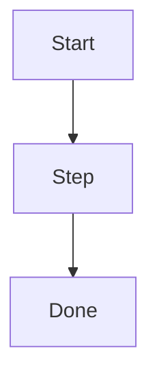

# Workflow: <Name>

## Purpose
- <what this workflow accomplishes>

## Trigger
- <when to use this workflow>

## Inputs
- <required inputs or documents>

## Outputs
- <artifacts produced>

## Preconditions
- <conditions required before starting>

## Steps
- [ ] <step 1>
- [ ] <step 2>

## Mermaid Diagram (optional)

## Artifacts Updated
- <memory bank files updated>

## Definition of Done
- <criteria to complete the workflow>
