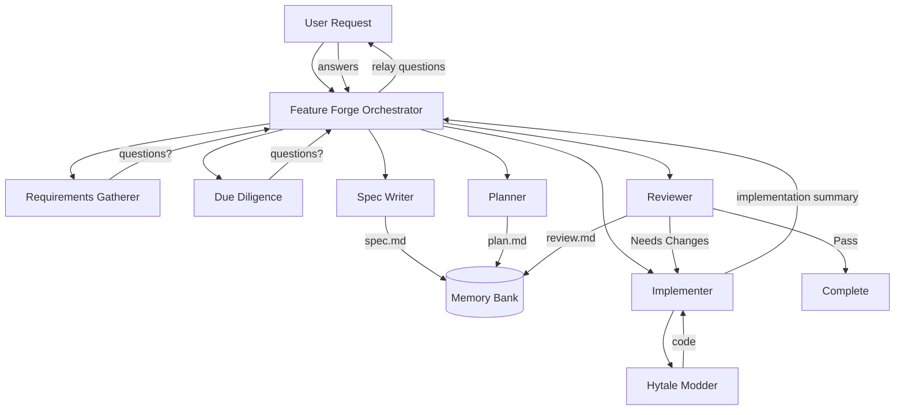

````markdown
# Workflow: Feature Forge

## Purpose
- Orchestrate large-scale Hyforged feature development from initial request through implementation and review.
- Ensure every feature goes through proper requirements, due diligence, spec, plan, implementation, and review phases.
- Maintain memory bank artifacts (specs, plans, reviews) as living documentation.

## Trigger
- Use when a feature request involves multiple systems, new ECS components/systems, or cross-cutting changes.
- Use for any feature that benefits from upfront planning rather than one-shot implementation.
- NOT for small bug fixes or trivial changes — use `Hytale Modder` directly for those.

## Inputs
- User's feature request or description
- Existing memory bank context (requirements, related features)

## Outputs
- `.memory_bank/Features/<slug>/<slug>.spec.md` — Feature specification
- `.memory_bank/Features/<slug>/<slug>.plan.md` — Phased implementation plan
- `.memory_bank/Features/<slug>/reviews/<slug>.review-001.md` — Implementation review
- Updated `.memory_bank/Requirements.md` — Feature index entry
- Implemented code (Java, JSON, UI, translations)

## Preconditions
- Project builds successfully before starting
- Hytale development environment is configured (JDK 25, Maven, tasks.json)

## Steps
- [ ] Gather requirements (via `requirements-gatherer` sub-agent)
- [ ] Perform due diligence (via `due-diligence` sub-agent)
- [ ] Write feature spec (via `spec-writer` sub-agent)
- [ ] Create implementation plan (via `planner` sub-agent)
- [ ] Execute plan phase-by-phase (via `implementer` sub-agent → `Hytale Modder`)
- [ ] Review implementation (via `reviewer` sub-agent)
- [ ] Address review findings if needed (loop implementer → reviewer)
- [ ] Update memory bank indices

## Mermaid Diagram



## Agent Architecture

| Agent | File | Role | Tools |
|-------|------|------|-------|
| Feature Forge | `feature-forge.agent.md` | Orchestrator (user-facing) | read, search, edit, execute, agent, web, todo |
| Requirements Gatherer | `requirements-gatherer.subagent.agent.md` | Sub-agent | read, search |
| Due Diligence | `due-diligence.subagent.agent.md` | Sub-agent | read, search, web |
| Spec Writer | `spec-writer.subagent.agent.md` | Sub-agent | read, search, edit |
| Planner | `planner.subagent.agent.md` | Sub-agent | read, search |
| Implementer | `implementer.subagent.agent.md` | Sub-agent (delegates to Hytale Modder) | read, search, edit, execute, agent, todo |
| Reviewer | `reviewer.subagent.agent.md` | Sub-agent | read, search |

## Artifacts Updated
- `.memory_bank/Features/<slug>/` — spec, plan, reviews
- `.memory_bank/Requirements.md` — feature index

## Definition of Done
- All phases complete
- Review passes (no Critical or Major findings)
- Build succeeds with zero warnings
- Memory bank artifacts saved and indexed
- User has been given a completion summary
````
